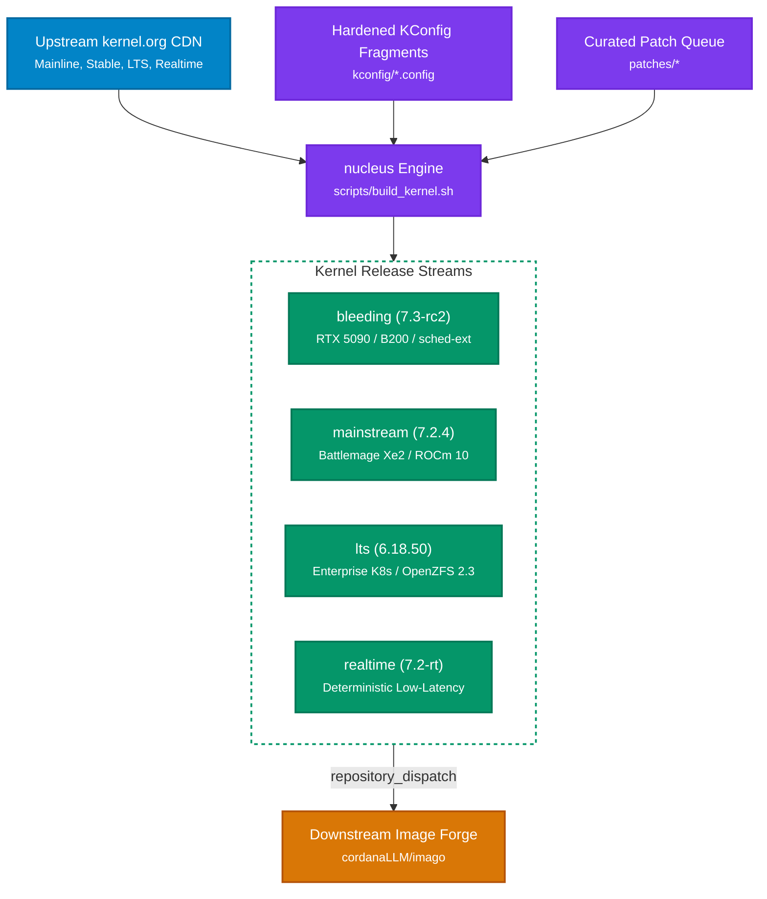

# Lusoris Kernel Forge

[](LICENSE)
[](.github/workflows/ci.yml)
[](https://github.com/cordanaLLM/imago)

`cordanaLLM/nucleus` is the companion repository and automated build forge producing customized, hardened, and hardware-optimized Linux kernel distributions for `imago`.

---

## 1. Mission & Architecture

`cordanaLLM/nucleus` decouples low-level kernel compilation from cloud image creation:
1. **Multi-Stream Channels**: Builds and packages 4 kernel streams from live upstream sources (kernel.org).
2. **Multi-Architecture**: Produces native `.deb` packages for `x86_64` (AMD64), `arm64` (AArch64), and `riscv64`.
3. **Hardened Configuration Fragments**: Enforces NASA/JPL Power of 10 principles, KSPP security hardening, BBRv3 congestion control, eBPF sched-ext scheduling, OpenZFS 2.3 kmod compatibility, and NVMe-oF TCP optimizations.
4. **Bidirectional Downstream Integration**: Synchronizes verified releases downstream to `imago` via GitHub `repository_dispatch`.



---

## 2. Kernel Streams Matrix

| Stream | Upstream Base | Target Workloads & Hardware Stack | Default In Flavors |
| :--- | :--- | :--- | :--- |
| **`bleeding`** | **Linux 7.3-rc2** | NVIDIA Blackwell RTX 5090 / B200, CXL 3.0, sched-ext, experimental BBRv3 | `*-nvidia-bleeding` |
| **`mainstream`** | **Linux 7.2.4** | Intel Arc Battlemage Xe2, AMD ROCm 10, NVIDIA 565/610, Podman 5.x | `base-*`, `docker-*`, `ai-infer-*` |
| **`lts`** | **Linux 6.18.50** | Enterprise Kubernetes nodes (`k8s-node-*`), OpenZFS 2.3, CloudNativePG (`cloudnative-pg`) | `k8s-node-*`, `cloudnative-storage` |
| **`realtime`** | **Linux 7.2-rt** | PREEMPT_RT deterministic gaming servers, low-latency audio/telecom, WireGuard gateway | `appliance-game-server`, `appliance-gateway-dns` |

---

## 3. Quickstart & Local Building

### Prerequisites
- Debian/Ubuntu host with kernel build dependencies:
  ```bash
  sudo apt-get update && sudo apt-get install -y \
      build-essential libncurses-dev bison flex libssl-dev libelf-dev \
      bc git fakeroot rsync debhelper kmod
  ```

### Build & Packaging Recipes
```bash
# Display all ergonomic developer targets
make help

# Merge KConfig fragments for target architecture
make merge-config ARCH=x86_64

# Package native Debian packages (.deb) with headers
make package-deb STREAM=mainstream ARCH=x86_64

# Synthesize Unified Kernel Image (UKI) PE binary (.efi)
make package-uki STREAM=mainstream ARCH=x86_64

# Run reproducible build attestation
make verify-reproducibility

# Execute sub-second QEMU microVM cold boot test
make test-boot

# Build hermetic multi-architecture container
make docker-builder
```

Output `.deb` packages and `.efi` UKI binaries are staged under `output/<stream>-<arch>/`.

---

## 4. Repository Structure

```
.
├── .github/workflows/          # Automated build & downstream synchronization workflows
├── AGENTS.md                   # Authoritative AI agent directives and standards
├── docs/                       # Architecture, onboarding, and stream documentation
│   ├── onboarding.md           # Step-by-step onboarding guide for agents & contributors
│   ├── principles.md           # Engineering principles & NASA/JPL Power of 10 adaptations
│   ├── streams.md              # Detailed stream specifications
│   └── patches.md              # Patch queue management & upstreaming policy
├── kconfig/                    # Modular kernel configuration fragments
│   ├── x86_64.config           # AMD64 virtualization & bare-metal baseline
│   ├── arm64.config            # AArch64 Neoverse & Apple Silicon baseline
│   ├── riscv64.config          # RISC-V 64-bit baseline
│   └── security-hardened.config# Kernel Self-Protection Project (KSPP) baseline
├── patches/                    # Curated patch queues partitioned by stream
├── scripts/                    # Verified build and notification automation
├── tests/                      # Automated pytest and static analysis suite
└── versions.json               # Declarative Single Source of Truth
```

---

## 5. Security & Privacy Invariants

- **Zero-Leak Invariant**: No RFC 1918 private IPs (`10.x`, `192.168.x`, `172.16-31.x`) or developer workstation paths (`/home/...`) are permitted in tracked files. Placeholders like `192.0.2.x` and `kernel.example.com` must be used.
- **Power of 10 Compliance**: All shell functions are constrained to $\le 60$ lines with `set -euo pipefail` and zero ShellCheck warnings.
- **Reproducible Builds**: All kernel compilation scripts pin exact upstream tarball checksums declared in `versions.json`.

---

## 6. License & Copyright

`cordanaLLM/nucleus` is open-source software licensed under the [Apache License 2.0](LICENSE).
Copyright &copy; 2026 The Lusoris Authors. All rights reserved.
