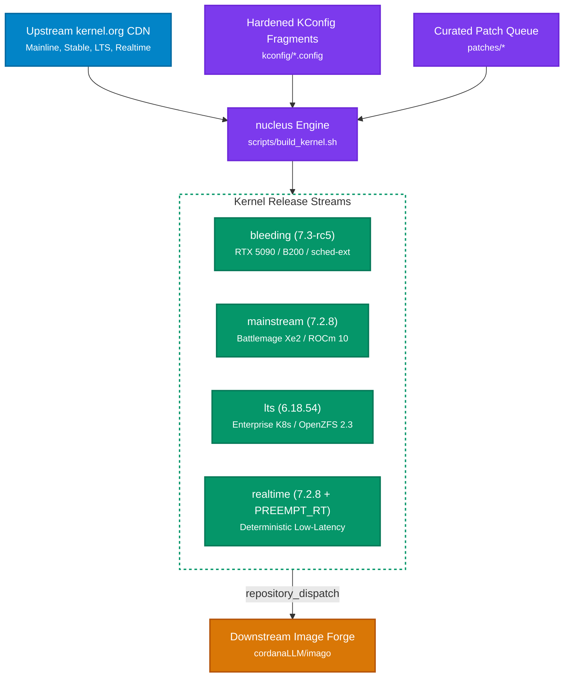

# Lusoris Kernel Forge

[](LICENSE)
[](.github/workflows/ci.yml)
[](https://github.com/cordanaLLM/imago)

`cordanaLLM/nucleus` is the companion repository and automated build forge producing customized, hardened, and hardware-optimized Linux kernel distributions for `imago`.

---

## 1. Mission & Architecture

`cordanaLLM/nucleus` decouples low-level kernel compilation from cloud image creation:
1. **Multi-Stream Channels**: Builds and packages 4 kernel streams from live upstream sources (kernel.org).
2. **Multi-Architecture**: Produces native `.deb` packages for `x86_64` (AMD64), `arm64` (AArch64), and `riscv64`.
3. **Hardened Configuration Fragments**: Enforces NASA/JPL Power of 10 principles, KSPP security hardening, BBRv3 congestion control, eBPF sched-ext scheduling, OpenZFS 2.3 kmod compatibility, and NVMe-oF TCP optimizations.
4. **Bidirectional Downstream Integration**: Synchronizes verified releases downstream to `imago` via GitHub `repository_dispatch`. A kernel release is tagged `v<version>-<stream>-lusoris<N>`; the repository's own releases are tagged `nucleus-v<X.Y.Z>` and never start one (section 5.4 of [`docs/packaging.md`](docs/packaging.md)).


```mermaid
flowchart TD
    classDef upstream fill:#0284c7,stroke:#0369a1,stroke-width:2px,color:#ffffff
    classDef engine fill:#7c3aed,stroke:#6d28d9,stroke-width:2px,color:#ffffff
    classDef stream fill:#059669,stroke:#047857,stroke-width:2px,color:#ffffff
    classDef dest fill:#d97706,stroke:#b45309,stroke-width:2px,color:#ffffff

    Upstream["Upstream kernel.org CDN<br/><small>Mainline, Stable, LTS, Realtime</small>"]:::upstream
    Forge["nucleus Engine<br/><small>scripts/build_kernel.sh</small>"]:::engine
    KConfig["Hardened KConfig Fragments<br/><small>kconfig/*.config</small>"]:::engine
    Patches["Curated Patch Queue<br/><small>patches/*</small>"]:::engine

    subgraph Streams["Kernel Release Streams"]
        Bleeding["bleeding (7.3-rc5)<br/><small>RTX 5090 / B200 / sched-ext</small>"]:::stream
        Mainstream["mainstream (7.2.8)<br/><small>Battlemage Xe2 / ROCm 10</small>"]:::stream
        LTS["lts (6.18.54)<br/><small>Enterprise K8s / OpenZFS 2.3</small>"]:::stream
        RT["realtime (7.2.8 + PREEMPT_RT)<br/><small>Deterministic Low-Latency</small>"]:::stream
    end

    Downstream["Downstream Image Forge<br/><small>cordanaLLM/imago</small>"]:::dest

    Upstream --> Forge
    KConfig --> Forge
    Patches --> Forge
    Forge --> Streams
    Streams -->|"repository_dispatch"| Downstream

    style Streams fill:none,stroke:#059669,stroke-width:2px,stroke-dasharray: 4 4
```

---

## 2. Kernel Streams Matrix

| Stream | Upstream Base | Target Workloads & Hardware Stack | Default In Flavors |
| :--- | :--- | :--- | :--- |
| **`bleeding`** | **Linux 7.3-rc5** | NVIDIA Blackwell RTX 5090 / B200, CXL 3.0, sched-ext, experimental BBRv3 | `*-nvidia-bleeding` |
| **`mainstream`** | **Linux 7.2.8** | Intel Arc Battlemage Xe2, AMD ROCm 10, NVIDIA 565/610, Podman 5.x | `base-*`, `docker-*`, `ai-infer-*` |
| **`lts`** | **Linux 6.18.54** | Enterprise Kubernetes nodes (`k8s-node-*`), OpenZFS 2.3, CloudNativePG (`cloudnative-pg`) | `k8s-node-*`, `cloudnative-storage` |
| **`realtime`** | **Linux 7.2.8**, in-tree `PREEMPT_RT` | PREEMPT_RT deterministic gaming servers, low-latency audio/telecom, WireGuard gateway | `appliance-game-server`, `appliance-gateway-dns` |

### Downstream Kernel Requirements

Consumers publish what they need from a kernel as an `aegis.p01-nucleus.kernel-requirement.v1` document, and `versions.json` `downstream.requirements` binds each one to the streams it consumes:

| Consumer | Document | Bound streams |
| :--- | :--- | :--- |
| `imago` | `cordanaLLM/imago` `kernel/requirement.json` | `bleeding`, `mainstream`, `lts`, `realtime` |
| `aegis-os` | `cordanaLLM/Aegis-OS` `build/kernel-requirement.json` | `realtime` |

`verify-requirements.yml` reads each document at a pinned commit and fails when a bound stream does not declare every required symbol in its exact state. To check the copies under `tests/fixtures/`:

```bash
python3 scripts/verify_kernel_requirement.py \
  --requirement imago=tests/fixtures/kernel-requirement/imago.json \
  --requirement aegis-os=tests/fixtures/kernel-requirement/aegis-os.json
```

The policy is [ADR-0007](docs/adr/0007-document-driven-kernel-requirements.md); the stream fragments and bindings are in [docs/streams.md](docs/streams.md).

---

## 3. Quickstart & Local Building

### Prerequisites
- An Ubuntu 26.04 host or container with the kernel build toolchain; the build workflows install
  it with the same script:
  ```bash
  sudo ./scripts/install-build-toolchain.sh             # add --with-qemu for the boot smoke test
  ```

### Build & Packaging Recipes
```bash
# Display all ergonomic developer targets
make help

# Merge the security baseline, architecture and stream fragments (STREAM defaults to mainstream)
make merge-config ARCH=x86_64 STREAM=realtime

# Fetch a stream's kernel source and prove it (pinned sha256 and kernel.org signature, or the
# signed release-candidate tag), then resolve the configuration against it and check that every
# requested value survived make olddefconfig; needs gpgv, gpg, pahole and the cross compilers
make fetch-source STREAM=realtime
make resolve-config STREAM=realtime ARCH=arm64

# Compile a stream into Debian packages: fetch, resolve, bindeb-pkg, then the artifact gate opens
# every package before anything is checksummed. Writes output/<stream>-<arch>/ (packages,
# vmlinuz-<kernelrelease>, kernel-<stream>-<arch>.config); DRY_RUN=true only states the plan
make build-kernel STREAM=mainstream ARCH=x86_64 DRY_RUN=false
make package-deb STREAM=mainstream ARCH=x86_64 DRY_RUN=false SOURCE_TREE=build/linux-mainstream

# Boot a built x86_64 kernel to userspace under QEMU
make boot-smoke KERNEL=output/mainstream-x86_64/vmlinuz-7.2.8-lusoris1-mainstream \
  KERNELRELEASE=7.2.8-lusoris1-mainstream

# Simulate Unified Kernel Image (UKI) synthesis: DRY_RUN=true is the Makefile default. It writes a
# marked text file under output/<stream>-<arch>-dry-run/, never a .efi.
# A real UKI needs a built kernel and ukify (DRY_RUN=false VMLINUZ=<path>); see docs/packaging.md, section 3.
make package-uki STREAM=mainstream ARCH=x86_64

# Run reproducible build attestation
make verify-reproducibility

# Run the hermetic tests of the boot smoke test
make test-boot

# Build hermetic multi-architecture container
make docker-builder
```

Output `.deb` packages, the kernel image and the resolved configuration are staged under
`output/<stream>-<arch>/`; the build record and log stay in `build/<stream>-<arch>/`
([`docs/packaging.md`](docs/packaging.md), section 2).

---

## 4. Repository Structure

```
.
├── .github/workflows/          # Automated build & downstream synchronization workflows
├── AGENTS.md                   # Authoritative AI agent directives and standards
├── docs/                       # Architecture, onboarding, and stream documentation
│   ├── onboarding.md           # Step-by-step onboarding guide for agents & contributors
│   ├── principles.md           # Engineering principles & NASA/JPL Power of 10 adaptations
│   ├── streams.md              # Detailed stream specifications
│   └── patches.md              # Patch queue management & upstreaming policy
├── keys/                       # kernel.org signing keys the source verification trusts
├── kconfig/                    # Modular kernel configuration fragments
│   ├── x86_64.config           # AMD64 virtualization & bare-metal baseline
│   ├── arm64.config            # AArch64 Neoverse & Apple Silicon baseline
│   ├── riscv64.config          # RISC-V 64-bit baseline
│   ├── streams/realtime.config # PREEMPT_RT stream layer
│   └── security-hardened.config# Kernel Self-Protection Project (KSPP) baseline
├── patches/                    # Curated patch queues partitioned by stream
├── scripts/                    # Verified build and notification automation
├── tests/                      # Automated pytest and static analysis suite
└── versions.json               # Declarative Single Source of Truth
```

---

## 5. Security & Privacy Invariants

- **Zero-Leak Invariant**: No RFC 1918 private IPs (`10.x`, `192.168.x`, `172.16-31.x`) or developer workstation paths (`/home/...`) are permitted in tracked files. Placeholders like `192.0.2.x` and `kernel.example.com` must be used.
- **Power of 10 Compliance**: All shell functions are constrained to $\le 60$ lines with `set -euo pipefail` and zero ShellCheck warnings.
- **Verified Sources**: Every kernel source is pinned in `versions.json` (a tarball `sha256`, or a tag and its commit) and used only after its kernel.org signature verifies against a key in `keys/` that the stream lists (`scripts/fetch-kernel-source.sh`, [ADR-0008](docs/adr/0008-signed-kernel-sources-and-resolved-configuration.md)).

---

## 6. License & Copyright

`cordanaLLM/nucleus` is open-source software licensed under the [Apache License 2.0](LICENSE).
Copyright &copy; 2026 The Lusoris Authors. All rights reserved.
