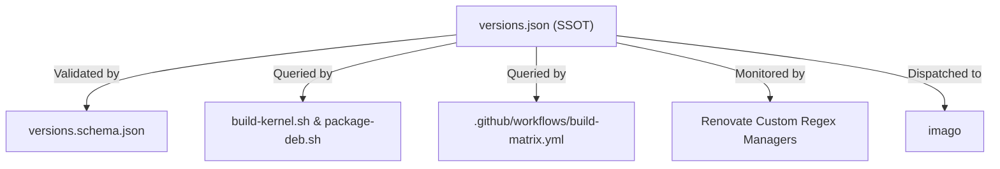

# ADR-0001: Declarative Kernel Manifest as Single Source of Truth

Date: 2026-09-10

## Status

Accepted

---

## Context

`cordanaLLM/nucleus` compiles, patches, hardens, and packages four concurrent Linux kernel release streams (`bleeding`, `mainstream`, `lts`, `realtime`) across three hardware architectures (`x86_64`, `arm64`, `riscv64`). 

In traditional kernel packaging setups, release numbers, Git commit hashes, upstream tarball URLs, and architecture targets are frequently scattered across Makefiles, shell build scripts, Dockerfiles, and GitHub Actions workflow YAML files. This fragmentation leads to:
1. **Configuration Drift**: A version bumped in a build script may be omitted in the packaging or CI matrix workflow, causing mismatched binaries.
2. **Brittle Automation**: Automated dependency bots (e.g. Renovate) cannot reliably locate and update versions buried within procedural shell logic or multi-line command strings.
3. **Lack of Validation**: Invalid URLs, malformed semver strings, or missing target architectures are only detected hours into a failed build pipeline.

---

## Decision

We establish [`versions.json`](https://github.com/cordanaLLM/nucleus/blob/main/versions.json) paired with a formal JSON Schema ([`versions.schema.json`](https://github.com/cordanaLLM/nucleus/blob/main/versions.schema.json)) as the sole, authoritative **Single Source of Truth (SSOT)** for the repository:

1. **Mandatory Schema Validation**: Every kernel stream must declare `version`, `tag`, `tarball_url`, `status`, and `description`. Target architectures must be explicitly enumerated in `architectures`.
2. **Zero Hardcoded Versions in Scripts**: Shell scripts (`scripts/build-kernel.sh`, `scripts/package-deb.sh`, `scripts/package-uki.sh`) and GitHub Actions workflows are strictly prohibited from hardcoding kernel version strings, URLs, or architectural lists. They must dynamically query `versions.json` using `python3` or `jq`.
3. **Atomic Version Bumps**: Updating any kernel stream requires modifying `versions.json` and updating documentation in the exact same commit.



---

## Consequences

### Positive
- **Deterministic Builds**: Compiler drivers and CI jobs always build the exact versions specified in the central manifest.
- **Automated Upstream Tracking**: Upstream point releases from `kernel.org` can be detected by Renovate and committed directly to `versions.json`.
- **Early Failure**: Malformed versions or syntax errors fail instantaneously during local `make lint` before any heavy compilation occurs.

### Negative
- **JSON Parsing Prerequisite**: Build scripts must rely on `jq` or `python3` being present in the execution environment to parse manifest fields.

---

## Compliance

Ongoing adherence is strictly enforced by automated quality gates:
1. **Local Linter (`make lint`)**:
   ```bash
   python3 -c "import json, jsonschema; jsonschema.validate(json.load(open('versions.json')), json.load(open('versions.schema.json'))); print('versions.json is valid')"
   ```
2. **Automated Pytest Suite (`tests/test_manifest.py`)**:
   - `test_manifest_schema_validation`: Validates complete manifest structure against `versions.schema.json`.
   - `test_manifest_streams`: Asserts the presence of all 4 required streams (`bleeding`, `mainstream`, `lts`, `realtime`).
   - `test_supported_architectures`: Asserts support for `x86_64`, `arm64`, and `riscv64`.
