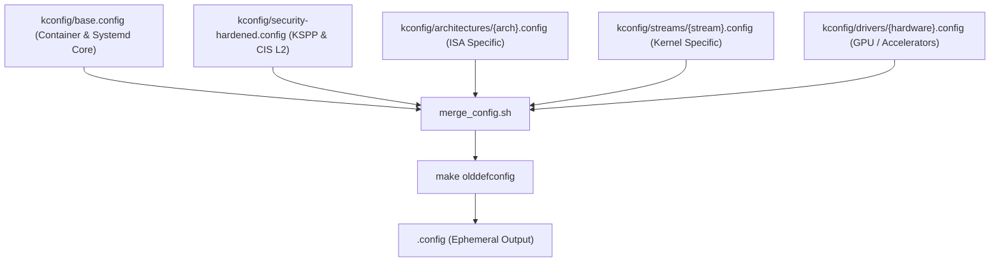

# ADR-0002: Modular KConfig Architecture

Date: 2026-09-10

## Status

Accepted

---

## Context

The Linux kernel source contains more than 15,000 configurable symbols (`CONFIG_*`). 

In conventional kernel packaging pipelines, distributions maintain large, monolithic `.config` files (often exceeding 10,000 lines each) for every combination of stream, release version, and target CPU architecture. This practice introduces severe architectural drawbacks:
1. **Excessive Duplication**: Shared baseline configurations—such as container cgroups, VirtIO drivers, and BPF verifier flags—are duplicated verbatim across dozens of monolithic files.
2. **Security Divergence**: When a new Kernel Self-Protection Project (KSPP) or CIS Benchmark control is adopted, maintainers must manually update every monolithic config. Inevitably, certain architectures or streams miss the update.
3. **Unreadable Diff Reviews**: Upstream minor version updates often reorder thousands of configuration symbols, producing massive, unreviewable Git diffs in pull requests.

---

## Decision

We adopt a **modular, composable KConfig fragment architecture** powered by the Linux kernel's standard upstream `scripts/kconfig/merge_config.sh` tool:

1. **Orthogonal Layering**: Kernel configuration is decomposed into discrete, reusable fragments:
   - `kconfig/base.config`: Fundamental hardware, systemd prerequisites, initramfs, cgroups v2, namespaces, and core filesystems (`ext4`, `xfs`, `overlayfs`).
   - `kconfig/security-hardened.config`: KSPP baseline, CIS Linux Level 2, strict W^X, KASLR, JIT constant blinding, stack canaries, and LSM stacking.
   - `kconfig/architectures/`: Architecture-specific ISA features (`x86_64.config`, `arm64.config`, `riscv64.config`).
   - `kconfig/drivers/`: Modular hardware acceleration profiles (`amd-rocm.config`, `intel-xe2.config`, `nvidia.config`).
   - `kconfig/streams/`: Stream-specific configurations (`bleeding.config`, `mainstream.config`, `lts.config`, `realtime.config`).
2. **Deterministic Composition**: The build engine merges relevant fragments dynamically for each compilation target:
   ```bash
   ./scripts/merge_config.sh -m -O "${BUILD_DIR}" \
     kconfig/base.config \
     kconfig/security-hardened.config \
     kconfig/architectures/${TARGET_ARCH}.config \
     kconfig/streams/${TARGET_STREAM}.config
   make -C /usr/src/linux O="${BUILD_DIR}" ARCH="${TARGET_ARCH}" olddefconfig
   ```
3. **No Monolithic Storage**: Only composable fragments are stored under version control. The full `.config` file is generated strictly as an ephemeral build artifact.



---

## Consequences

### Positive
- **Single Source for Security**: Modifying `kconfig/security-hardened.config` instantly and universally hardens all 4 streams and all 3 CPU architectures.
- **Trivial Addition of New Hardware**: Enabling a new GPU family (e.g. Intel Battlemage Xe2) requires authoring an isolated 20-line fragment rather than regenerating 12 monolithic configs.
- **Review Clarity**: Pull requests to kconfig fragments are compact, readable, and focus exclusively on the specific feature or driver being introduced.

### Negative
- **Dependency Resolution Nuance**: Kernel symbols occasionally have complex KConfig dependency chains (`depends on`). A symbol declared in a fragment will be silently ignored if its upstream dependency is not satisfied. The `make olddefconfig` step must be verified to ensure symbols are actually activated.

---

## Compliance

Enforced via automated test automation in `tests/test_kconfig.py`:
1. `test_kconfig_fragments_exist`: Asserts all required base, security, and stream fragments exist in `kconfig/`.
2. `test_kconfig_mandatory_options`: Asserts mandatory container orchestration options (`CONFIG_NAMESPACES`, `CONFIG_CGROUPS`, `CONFIG_OVERLAY_FS`, `CONFIG_VIRTIO`) are enabled across all fragments.
3. `test_security_hardened_kconfig`: Asserts strict compliance with KSPP symbols (`CONFIG_STRICT_KERNEL_RWX`, `CONFIG_STACKPROTECTOR_STRONG`, `CONFIG_RANDOMIZE_BASE`).
