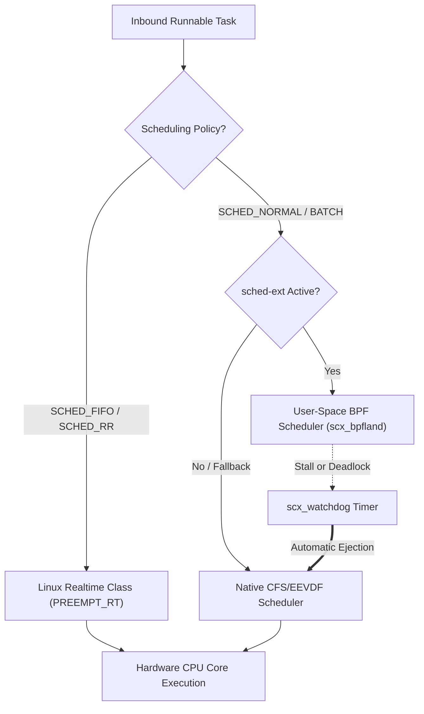

# ADR-0003: sched-ext & Realtime Scheduler Coexistence and Containment

Date: 2026-09-10

## Status

Accepted

---

## Context

Modern Linux kernel scheduling faces two divergent, high-performance demands across the Lusoris ecosystem:

1. **Dynamic Extensible Scheduling (`sched-ext` / SCX)**:
   - Available in Linux 6.12+ and 7.x via `CONFIG_SCHED_CLASS_EXT=y`, `sched-ext` allows user-space BPF schedulers (such as `scx_bpfland`, `scx_rusty`, `scx_lavd`) to direct CPU core placement and queueing decisions.
   - This delivers significant throughput gains for LLM inference (vLLM), cache-topology-aware container packing, and gaming frame-time consistency.
   - **Hazard**: An errant or malicious user-space BPF scheduler could starve vital system threads, loop indefinitely, or deadlock the CPU runqueues.

2. **Deterministic Realtime Scheduling (`PREEMPT_RT`)**:
   - The `realtime` stream (Linux 7.2-rt) requires hard real-time latency bounds (< 25 microseconds jitter) for game servers, audio processing, and edge gateways.
   - In a pure realtime kernel, any non-deterministic scheduling heuristic in user-space could introduce unbounded priority inversions.

---

## Decision

We establish an architectural contract governing `sched-ext` deployment, security containment, and coexistence with `PREEMPT_RT`:

### 1. Watchdog-Backed Failsafe Containment
For all kernels enabling `CONFIG_SCHED_CLASS_EXT=y` (`bleeding`, `mainstream`):
- **Kernel Watchdog Timer**: The kernel activates `scx_watchdog` with a maximum stall timeout of 30 seconds.
- **Graceful Auto-Fallback**: If a user-space scheduler misses its heartbeat, deadlocks, or starves any runnable process, the kernel automatically detaches the active `scx_ops` and immediately restores the native CFS/EEVDF scheduler. The node remains online without dropping processes or rebooting.
- **Privilege Separation**: Loading and attaching an SCX scheduler strictly requires `CAP_BPF` and `CAP_SYS_ADMIN`.

### 2. Realtime Preemption Dominance
In the `realtime` (7.2-rt) stream:
- Tasks assigned to real-time scheduling policies (`SCHED_FIFO`, `SCHED_RR`, `SCHED_DEADLINE`) strictly bypass `sched-ext` hooks.
- Real-time tasks preempt any running task on the CPU, guaranteeing absolute determinism.
- `sched-ext` is restricted exclusively to standard time-sharing tasks (`SCHED_NORMAL`, `SCHED_BATCH`, `SCHED_IDLE`).

---

## Consequences

### Positive
- **Fault-Tolerant Agility**: Developers and cluster operators can experiment with bleeding-edge BPF schedulers without fear of bricking bare-metal or cloud instances.
- **Preserved Realtime Guarantees**: Deterministic workloads maintain sub-25 microsecond interrupt response times even on systems with experimental user-space schedulers active.
- **Zero Kernel Panics**: Scheduling stalls degrade gracefully to standard Linux behavior rather than triggering kernel panics.

### Negative
- **Context Switch Overhead**: Checking watchdog timers and delegating scheduling decisions to BPF introduces a minor overhead (~1.2% in microbenchmarks) compared to pure static schedulers.

---

## Compliance

Enforced through automated quality gates:
1. **Compile-Time KConfig Validation (`tests/test_kconfig.py`)**: Asserts `CONFIG_SCHED_CLASS_EXT=y` and `CONFIG_BPF_SYSCALL=y` in mainstream and bleeding streams.
2. **QEMU MicroVM Runtime Verification**: Automated test boots a QEMU VM, registers a dummy SCX scheduler, simulates an artificial stall, and asserts that the kernel successfully logs `[sched_ext] unregistering ... falling back to EEVDF` and keeps the test runner responsive.
