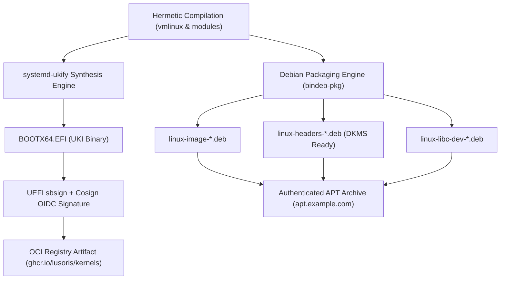

# ADR-0004: Native Debian & UKI Dual Packaging Architecture

Date: 2026-09-10

## Status

Accepted

---

## Context

Kernels compiled by `lusoris-kernel-forge` are consumed across two fundamentally different deployment patterns:

1. **Standard Cloud & Virtual Machine Instances (`lusoris-cloud-images`)**:
   - VM flavors (Proxmox VE, VMware, KVM, Docker, Kubernetes) rely on standard Debian/Ubuntu package managers (`apt`, `dpkg`).
   - Third-party out-of-tree drivers (e.g. OpenZFS 2.3, NVIDIA Open Kernel Modules) require matching C development headers (`linux-headers`) to compile kernel modules via DKMS during golden image provisioning.
2. **High-Assurance Bare-Metal & Confidential Computing**:
   - Modern bare-metal clusters, edge appliances, and confidential computing microVMs require **Unified Kernel Images (UKI)**.
   - Traditional `/boot` partitions containing separate kernel binaries (`vmlinuz`), initial ramdisks (`initrd.img`), and bootloader configurations (`grub.cfg`) are vulnerable to tampering: an attacker with disk write access can modify the initramfs or inject malicious kernel cmdline parameters (`init=/bin/sh`) without breaking UEFI Secure Boot signatures on `vmlinuz`.

---

## Decision

We establish a **Dual Packaging Architecture** delivering both package formats from every kernel build:

### 1. Native Debian Packaging (`bindeb-pkg`)
- Executed via upstream kernel target `make bindeb-pkg`.
- Generates `linux-image`, `linux-headers`, and `linux-libc-dev` Debian packages.
- Features reproducible localversion strings (e.g. `-lusoris1-mainstream-amd64`), preventing name clashes with stock Debian/Ubuntu kernels.
- Published to `https://apt.example.com/kernels/` via `reprepro` with GPG detached signatures.

### 2. Unified Kernel Images (`systemd-ukify`)
- Synthesizes a single executable UEFI PE binary conforming to the UAPI Boot Loader Specification.
- Embeds `.linux`, `.initrd` (Dracut initramfs + CPU microcode), `.cmdline`, `.osrel`, and `.sbat`.
- Measured into **TPM 2.0 PCR 11**, enabling tamper-proof disk encryption key sealing via `systemd-cryptenroll`.
- Signed cryptographically and published as OCI artifacts to `ghcr.io/lusoris/kernels`.

---

## Consequences

### Positive
- **Complete Ecosystem Coverage**: Traditional cloud golden images install `.deb` packages via apt; modern bare-metal systems stream signed UKI `.efi` binaries over iPXE or deploy to EFI system partitions.
- **Full DKMS Compatibility**: `linux-headers-*.deb` provides the full kernel build environment necessary for compiling NVIDIA 565/615 and OpenZFS 2.3 modules without full source tree checkout.
- **Tamper-Proof Boot Security**: UKI eliminates mutable `/boot/initrd.img` tampering attacks by cryptographically binding kernel, initramfs, and cmdline into a single signed entity.

### Negative
- **Dual Pipeline Maintenance**: CI must execute both Debian packaging and `ukify` assembly steps, requiring `dracut`, `systemd-ukify`, `sbsign`, and `dpkg-dev` in the builder image.

---

## Compliance

Enforced via automated test gates:
1. **Packaging Script Audits (`tests/test_scripts.py`)**: Asserts `scripts/package-deb.sh` and `scripts/package-uki.sh` are executable, comply with `set -euo pipefail`, have functions $\le 60$ lines, and pass ShellCheck.
2. **Artifact Verification in CI**: The release pipeline verifies the generation, checksum digests, and cryptographic signatures of both `.deb` archives and `.efi` UKI binaries before dispatching release events downstream.
