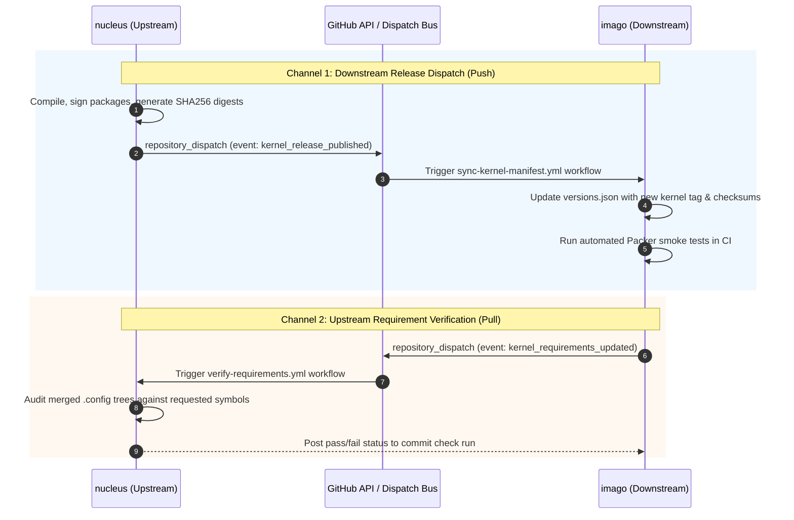

# ADR-0005: Bidirectional Downstream Image Forge Synchronization

Date: 2026-09-10

## Status

Accepted

---

## Context

`cordanaLLM/nucleus` is architected as the dedicated kernel compilation sister repository to [`cordanaLLM/imago`](https://github.com/cordanaLLM/imago). 

In decoupled multi-repository architectures, cross-repository synchronization often deteriorates into manual coordination:
1. **Release Lag**: When a new kernel release or critical security patch is compiled, days or weeks pass before human operators manually edit `versions.json` in the downstream image repository.
2. **Silent ABI Incompatibilities**: If a kernel build alters an exported symbol, disables a required filesystem driver, or deprecates a module, downstream Packer image builds fail unpredictably.
3. **Unidirectional Bottleneck**: Downstream cloud image flavors frequently introduce new kernel requirements (e.g., eBPF container runtime flags, Intel Battlemage Xe2 DRM, OpenZFS 2.3 kmod hooks), but have no automated mechanism to request and verify those symbols in upstream kernel configs.

---

## Decision

We establish an automated **Bidirectional Cross-Repository Synchronization Engine** operating via GitHub Actions `repository_dispatch` webhooks and Renovate custom regex managers:



### 1. Downstream Release Dispatch (`kernel-forge` -> `cloud-images`)
Upon successful compilation, cryptographic signing, and package publication, `cordanaLLM/nucleus` executes `.github/workflows/publish-release.yml`:
- Dispatches a `kernel_release_published` event to `cordanaLLM/imago`.
- The payload includes the stream name, semver version, target architectures, and cryptographic SHA-256 digests.
- Downstream, an automated workflow opens a pull request or commits directly to `imago/versions.json`, triggering smoke image builds across all affected flavors.

### 2. Upstream Requirement Verification (`cloud-images` -> `kernel-forge`)
When `cordanaLLM/imago` defines new kernel requirements in its flavor specs:
- It emits a `kernel_requirements_updated` event to `cordanaLLM/nucleus`.
- `verify-requirements.yml` validates that all active `.config` trees contain the requested symbols (`CONFIG_VIRTIO_NET=y`, `CONFIG_BBR3=y`, etc.).

### 3. Declarative SSOT Linkage
The downstream dispatch targets and event names are declared in [`versions.json`](https://github.com/cordanaLLM/nucleus/blob/main/versions.json):
```json
"downstream": {
  "repository": "cordanaLLM/imago",
  "sync_event": "kernel_release_published"
}
```

---

## Consequences

### Positive
- **Zero-Latency Rollout**: As soon as a kernel build succeeds, the downstream image forge begins building updated cloud images.
- **Immediate Detection of Breaking Changes**: Downstream CI tests immediately catch module loading issues or ABI incompatibilities before any artifact reaches production users.
- **Formalized Upstream/Downstream Contract**: Both repositories maintain clear boundaries while communicating through well-defined JSON event schemas.

### Negative
- **Cross-Repository Token Scoping**: Requires managing a GitHub Fine-Grained Personal Access Token (`DISPATCH_ACCESS_TOKEN`) with scoped repository dispatch permissions.

---

## Compliance

Enforced via automated quality gates:
1. **Manifest Schema Validation (`tests/test_manifest.py`)**: Asserts `versions.json` contains valid `downstream.repository` and `downstream.sync_event` declarations conforming to `versions.schema.json`.
2. **Workflow Security Validation**: Workflows enforce least-privilege token permissions (`contents: read`), isolating token secrets strictly to the dispatch step.
