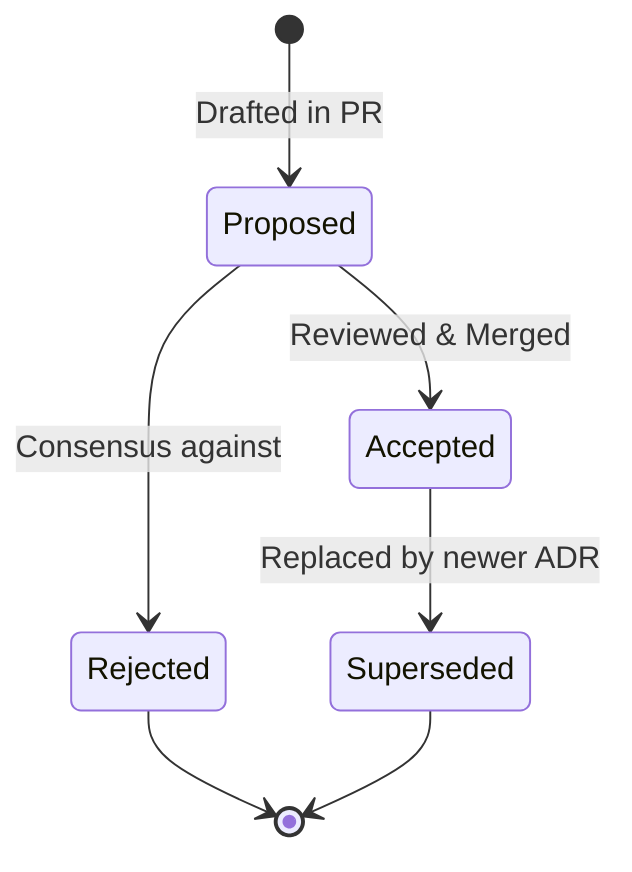

# Architecture Decision Records (ADRs)

> Historical index and governance registry of Architectural Decision Records for `lusoris-kernel-forge`.

---

## 1. Overview & ADR Lifecycle

An **Architecture Decision Record (ADR)** documents a significant software architecture decision made for `lusoris-kernel-forge`, along with its context, rationale, consequences, and automated compliance enforcement.

Once an ADR is reviewed, approved, and merged, its status is marked **Accepted**, and its text becomes an immutable historical document. If future technical requirements necessitate reversing or modifying an accepted architectural decision, a new ADR must be drafted that explicitly supersedes the earlier decision.

---

## 2. ADR Index

The following table indexes all architectural decision records governing `lusoris-kernel-forge`:

| ADR Number | Title | Status | Date | Primary Focus Area |
| :--- | :--- | :--- | :--- | :--- |
| [**ADR-0001**](0001-declarative-kernel-manifest.md) | Declarative Version Manifest as Single Source of Truth | `Accepted` | 2026-09-10 | Architecture SSOT & Versioning |
| [**ADR-0002**](0002-modular-kconfig-architecture.md) | Modular KConfig Fragment Architecture | `Accepted` | 2026-09-10 | Kernel Configuration & Maintenance |
| [**ADR-0003**](0003-sched-ext-and-realtime-scheduler-coexistence.md) | sched-ext & Realtime (PREEMPT_RT) Coexistence & Containment | `Accepted` | 2026-09-10 | CPU Scheduling & eBPF Security |
| [**ADR-0004**](0004-native-debian-and-uki-dual-packaging.md) | Native Debian (`bindeb-pkg`) & UKI (`systemd-ukify`) Dual Packaging | `Accepted` | 2026-09-10 | Packaging & Release Distribution |
| [**ADR-0005**](0005-bidirectional-image-forge-synchronization.md) | Bidirectional Downstream Image Forge Synchronization | `Accepted` | 2026-09-10 | Cross-Repo CI/CD Automation |

---

## 3. ADR Authoring Standards

All future ADRs must adhere to the standardized structure:
1. **Title & Number**: Sequential identifier (`ADR-000X: Title`).
2. **Date**: ISO 8601 creation date (`YYYY-MM-DD`).
3. **Status**: `Proposed`, `Accepted`, `Rejected`, or `Superseded`.
4. **Context**: Technical problem statement, forces, trade-offs, and invariants.
5. **Decision**: Concrete architectural choice and detailed implementation strategy.
6. **Consequences**: Explicit positive, negative, and neutral trade-offs.
7. **Compliance**: Automated test suites, CI quality gates, or linters that verify ongoing conformity.
