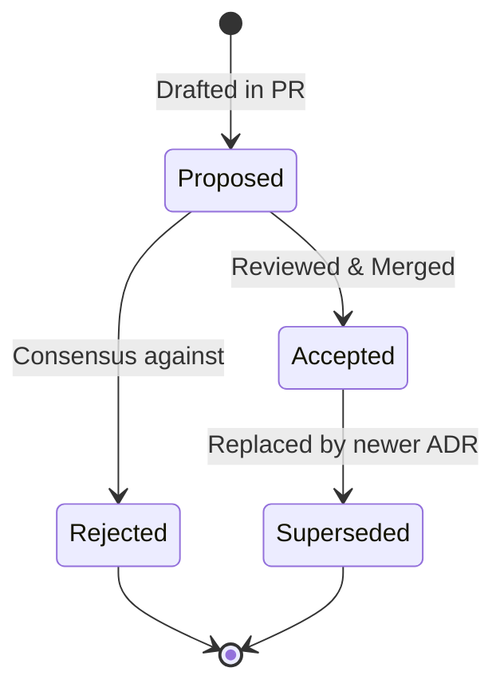

# Architecture Decision Records (ADRs)

> Historical index and governance registry of Architectural Decision Records for `cordanaLLM/nucleus`.

---

## 1. Overview & ADR Lifecycle

An **Architecture Decision Record (ADR)** documents a significant software architecture decision made for `cordanaLLM/nucleus`, along with its context, rationale, consequences, and automated compliance enforcement.

Once an ADR is reviewed, approved, and merged, its status is marked **Accepted**, and its text becomes an immutable historical document. If future technical requirements necessitate reversing or modifying an accepted architectural decision, a new ADR must be drafted that explicitly supersedes the earlier decision.

```mermaid
stateDiagram-v2
    [*] --> Proposed: Drafted in PR
    Proposed --> Accepted: Reviewed & Merged
    Proposed --> Rejected: Consensus against
    Accepted --> Superseded: Replaced by newer ADR
    Rejected --> [*]
    Superseded --> [*]
```

---

## 2. ADR Index

The following table indexes all architectural decision records governing `cordanaLLM/nucleus`:

| ADR Number | Title | Status | Date | Primary Focus Area |
| :--- | :--- | :--- | :--- | :--- |
| [**ADR-0001**](0001-declarative-kernel-manifest.md) | Declarative Version Manifest as Single Source of Truth | `Accepted`; stream sources and architecture data: see [ADR-0008](0008-signed-kernel-sources-and-resolved-configuration.md) | 2026-09-10 | Architecture SSOT & Versioning |
| [**ADR-0002**](0002-modular-kconfig-architecture.md) | Modular KConfig Fragment Architecture | `Accepted`; base configuration and resolution: see [ADR-0008](0008-signed-kernel-sources-and-resolved-configuration.md) | 2026-09-10 | Kernel Configuration & Maintenance |
| [**ADR-0003**](0003-sched-ext-and-realtime-scheduler-coexistence.md) | sched-ext & Realtime (PREEMPT_RT) Coexistence & Containment | `Accepted` | 2026-09-10 | CPU Scheduling & eBPF Security |
| [**ADR-0004**](0004-native-debian-and-uki-dual-packaging.md) | Native Debian (`bindeb-pkg`) & UKI (`systemd-ukify`) Dual Packaging | `Accepted`; OCI destination: see [ADR-0006](0006-oci-registry-namespace.md); localversion and headers packages: see [ADR-0009](0009-kernel-compilation-and-artifact-gate.md) | 2026-09-10 | Packaging & Release Distribution |
| [**ADR-0005**](0005-bidirectional-image-forge-synchronization.md) | Bidirectional Downstream Image Forge Synchronization | `Accepted`; requirement verification: see [ADR-0007](0007-document-driven-kernel-requirements.md) | 2026-09-10 | Cross-Repo CI/CD Automation |
| [**ADR-0006**](0006-oci-registry-namespace.md) | OCI Registry Namespace for UKI Artifacts (supersedes the OCI destination of ADR-0004) | `Accepted` | 2026-09-29 | Packaging & Release Distribution |
| [**ADR-0007**](0007-document-driven-kernel-requirements.md) | Document-Driven Kernel Requirement Verification with Per-Consumer Stream Binding (supersedes section 2 of ADR-0005) | `Accepted`; owner schema check: see [ADR-0010](0010-owner-json-schema-for-requirement-documents.md) | 2026-09-29 | Cross-Repo Requirement Contract |
| [**ADR-0008**](0008-signed-kernel-sources-and-resolved-configuration.md) | Signed Kernel Sources and a Resolved, Survival-Checked Kernel Configuration (supersedes decision item 1 of ADR-0001 and items 1 and 2 of ADR-0002; amends section 4 of ADR-0007) | `Accepted` | 2026-09-29 | Kernel Sources & Configuration |
| [**ADR-0009**](0009-kernel-compilation-and-artifact-gate.md) | Kernel Compilation, the Artifact Gate and the Boot Smoke Test (supersedes bullets 2 and 3 of section 1 of ADR-0004) | `Accepted` | 2026-09-29 | Kernel Build & Release Integrity |
| [**ADR-0010**](0010-owner-json-schema-for-requirement-documents.md) | Requirement Documents Are Read Through the Owner's JSON Schema, Pinned by Commit and Digest (adds a check to ADR-0007) | `Proposed` | 2026-09-29 | Cross-Repo Requirement Contract |

---

## 3. ADR Authoring Standards

All future ADRs must adhere to the standardized structure:
1. **Title & Number**: Sequential identifier (`ADR-000X: Title`).
2. **Date**: ISO 8601 creation date (`YYYY-MM-DD`).
3. **Status**: `Proposed`, `Accepted`, `Rejected`, or `Superseded`.
4. **Context**: Technical problem statement, forces, trade-offs, and invariants.
5. **Decision**: Concrete architectural choice and detailed implementation strategy.
6. **Consequences**: Explicit positive, negative, and neutral trade-offs.
7. **Compliance**: Automated test suites, CI quality gates, or linters that verify ongoing conformity.
