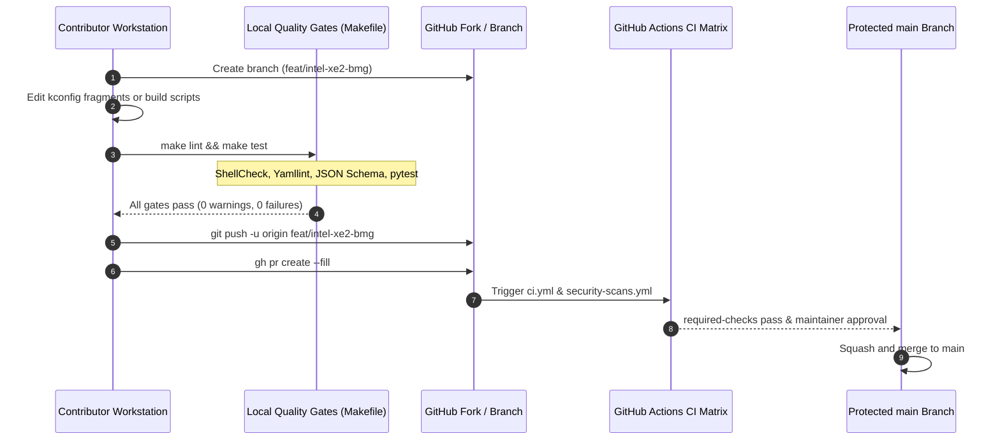

# Contributing to lusoris-kernel-forge

> Authoritative contributor guidelines, quality gates, and pull request workflows for `lusoris-kernel-forge`.

---

## 1. Core Operating Principles

Thank you for contributing to `lusoris-kernel-forge`! We welcome contributions ranging from new hardware driver fragments and curated patch queues to cross-compilation enhancements and security hardening.

All contributions must honor the repository's foundational invariants:

1. **Trunk-Based Development**: Direct commits to `main` are strictly prohibited. Always branch from `main` using short-lived branches (`feat/*`, `fix/*`, `chore/*`, `docs/*`).
2. **Single Source of Truth (`versions.json`)**: Upstream tarball URLs, release tags, and supported architectures must originate exclusively from [`versions.json`](https://github.com/lusoris/lusoris-kernel-forge/blob/main/versions.json).
3. **NASA/JPL Power of 10**: All shell build and automation functions must be $\le 60$ lines, enforce `set -euo pipefail`, check return codes, and pass `shellcheck` with zero warnings.
4. **Docs & Code Synchrony**: Every user-discoverable change (new stream, configuration variable, or build script modification) must be reflected in documentation in the **exact same commit**.
5. **Zero-Leak Invariant**: Never commit RFC 1918 private IP addresses (`10.x`, `192.168.x`, `172.16-31.x`) or local workstation home paths. Use standard placeholders (`192.0.2.x`, `kernel.example.com`, `/opt/lusoris/...`).
6. **English Register**: All commits, documentation, and PR discussions are conducted in neutral, professional English.

---

## 2. Development & Pull Request Workflow



### Step-by-Step Instructions:

1. **Create a topic branch**:
   ```bash
   git checkout -b feat/add-bbr3-fragment
   ```
2. **Implement changes**:
   - Keep changes minimal, coherent, and isolated.
   - Do not reformat nearby files for aesthetic reasons alone.
3. **Run local verification gates**:
   ```bash
   make lint
   make test
   ```
4. **Commit with Conventional Commits**:
   ```bash
   git commit -m "feat(kconfig): enable BBRv3 congestion control on mainstream"
   ```
   Allowed types: `feat`, `fix`, `docs`, `style`, `refactor`, `perf`, `test`, `chore`, `ci`.
5. **Push and open a Pull Request**:
   ```bash
   git push -u origin feat/add-bbr3-fragment
   gh pr create --fill
   ```

---

## 3. Developer Certificate of Origin (DCO)

By contributing to this repository, you certify that you have the right to submit the code under the project's Apache 2.0 license:

```text
Developer Certificate of Origin
Version 1.1

By making a contribution to this project, I certify that:
(a) The contribution was created in whole or in part by me and I
    have the right to submit it under the open source license
    indicated in the file; or
(b) The contribution is based upon previous work that, to the best
    of my knowledge, is covered under an appropriate open source
    license and I have the right under that license to submit that
    work with modifications.
```
