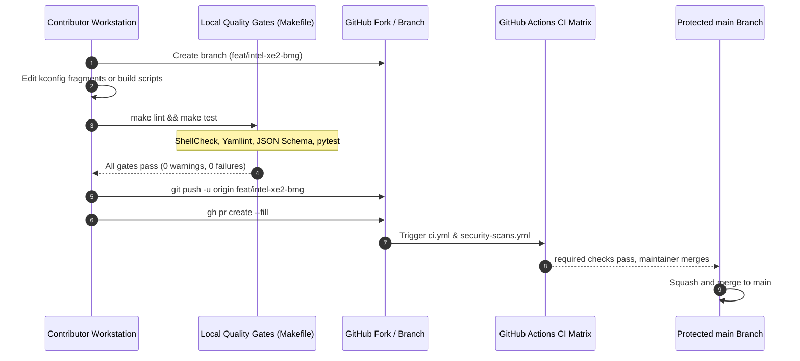

# Contributing to nucleus

> Authoritative contributor guidelines, quality gates, and pull request workflows for `cordanaLLM/nucleus`.

---

## 1. Core Operating Principles

Thank you for contributing to `cordanaLLM/nucleus`! We welcome contributions ranging from new hardware driver fragments and curated patch queues to cross-compilation enhancements and security hardening.

All contributions must honor the repository's foundational invariants:

1. **Trunk-Based Development**: Direct commits to `main` are strictly prohibited. Always branch from `main` using short-lived branches (`feat/*`, `fix/*`, `chore/*`, `docs/*`).
2. **Single Source of Truth (`versions.json`)**: Upstream tarball URLs, release tags, and supported architectures must originate exclusively from [`versions.json`](https://github.com/cordanaLLM/nucleus/blob/main/versions.json).
3. **NASA/JPL Power of 10**: All shell build and automation functions must be $\le 60$ lines, enforce `set -euo pipefail`, check return codes, and pass `shellcheck` with zero warnings.
4. **Docs & Code Synchrony**: Every user-discoverable change (new stream, configuration variable, or build script modification) must be reflected in documentation in the **exact same commit**.
5. **Zero-Leak Invariant**: Never commit RFC 1918 private IP addresses (`10.x`, `192.168.x`, `172.16-31.x`) or local workstation home paths. Use standard placeholders (`192.0.2.x`, `kernel.example.com`, `/opt/lusoris/...`).
6. **English Register**: All commits, documentation, and PR discussions are conducted in neutral, professional English.

---

## 2. Development & Pull Request Workflow


```mermaid
sequenceDiagram
    autonumber
    participant Contributor as Contributor Workstation
    participant Local as Local Quality Gates (Makefile)
    participant Origin as GitHub Fork / Branch
    participant CI as GitHub Actions CI Matrix
    participant Main as Protected main Branch

    Contributor->>Origin: Create branch (feat/intel-xe2-bmg)
    Contributor->>Contributor: Edit kconfig fragments or build scripts
    Contributor->>Local: make lint && make test
    Note over Local: ShellCheck, Yamllint, JSON Schema, pytest
    Local-->>Contributor: All gates pass (0 warnings, 0 failures)
    Contributor->>Origin: git push -u origin feat/intel-xe2-bmg
    Contributor->>Origin: gh pr create --fill
    Origin->>CI: Trigger ci.yml & security-scans.yml
    CI-->>Main: required checks pass, maintainer merges
    Main->>Main: Squash and merge to main
```

### Step-by-Step Instructions:

1. **Create a topic branch**:
   ```bash
   git checkout -b feat/add-bbr3-fragment
   ```
2. **Implement changes**:
   - Keep changes minimal, coherent, and isolated.
   - Do not reformat nearby files for aesthetic reasons alone.
3. **Run local verification gates**:
   ```bash
   make lint
   make test
   ```
   When you add or bump an action pin under `.github/workflows/`, also run `make lint-pins`.
   It asks GitHub whether each `# <tag>` comment points to the pinned commit, so it needs
   network access and an authenticated `gh`; `ci.yml` runs it on every pull request.
4. **Commit with Conventional Commits**:
   ```bash
   git commit -m "feat(kconfig): enable BBRv3 congestion control on mainstream"
   ```
   Allowed types: `feat`, `fix`, `docs`, `style`, `refactor`, `perf`, `test`, `chore`, `ci`.
5. **Push and open a Pull Request**:
   ```bash
   git push -u origin feat/add-bbr3-fragment
   gh pr create --fill
   ```

### Release Tags

Merging the release pull request tags the repository's release `nucleus-v<X.Y.Z>` and
writes that version into `VERSION`. A kernel is released by a different tag,
`v<version>-<stream>-lusoris<N>`, whose `<version>` must equal the stream's version in
`versions.json`, and whose `N` is the forge revision, 1 to 9999 without leading zeros: a
second revision releases the same upstream version again with a new kernel release. Only
the kernel tag starts `publish-release.yml`, a manual run must start from that tag
(`--ref`), and the downstream dispatch needs the `KERNEL_FORGE_TOKEN` secret, checked
before anything is built. [Packaging](../packaging.md) sections 5.4 and 5.5 describe both.

### Agent Context and praetor Governance

`AGENTS.md` is the only hand-edited agent instruction file. `CLAUDE.md`, `.codex/rules.md`,
`.cursor/rules/hiss-invariants.mdc`, `.gemini/GEMINI.md`, `.github/copilot-instructions.md`
and `.windsurfrules` are compiled from it: after every change to `AGENTS.md`, run
`make context` and commit the regenerated files in the same commit. The `Praetor Governance`
CI job fails when they differ from `AGENTS.md`.

The praetor commit this repository is governed by is pinned in one place, `PRAETOR_COMMIT` in
`.github/workflows/ci.yml`. `versions.json` pins kernel streams, not tools. To move the pin,
follow [Moving the pin](../repository-governance.md#moving-the-pin): copy the catalog files
from the new commit when they changed, regenerate `.standards.lock` in a scratch clone, set
`PRAETOR_COMMIT` to the full SHA, and run `make governance-check`, `make context`,
`make ruleset`, `make lint` and `make test`.

A change that adds, removes or renames a job in a workflow that runs on pull requests also
runs `make ruleset`, because `.github/rulesets/main.json` lists those jobs as required checks.

---

## 3. Developer Certificate of Origin (DCO)

By contributing to this repository, you certify that you have the right to submit the code under the project's Apache 2.0 license:

```text
Developer Certificate of Origin
Version 1.1

By making a contribution to this project, I certify that:
(a) The contribution was created in whole or in part by me and I
    have the right to submit it under the open source license
    indicated in the file; or
(b) The contribution is based upon previous work that, to the best
    of my knowledge, is covered under an appropriate open source
    license and I have the right under that license to submit that
    work with modifications.
```
