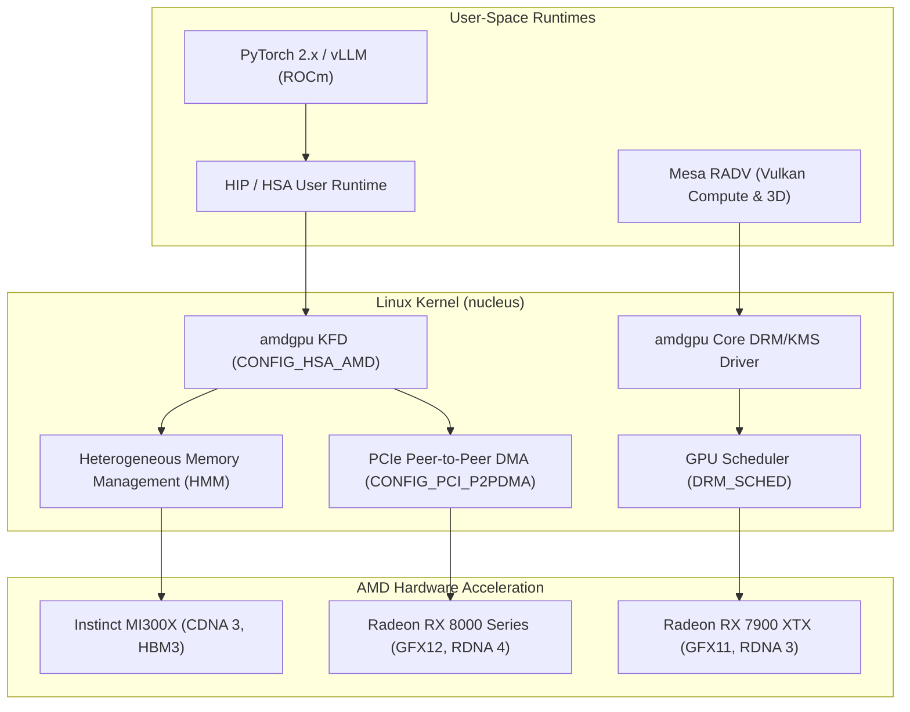

# AMD ROCm 10 & Mesa RADV Acceleration

> Authoritative engineering guide on configuring the Linux kernel for AMD ROCm 10 compute, Heterogeneous Memory Management (HMM), and Mesa RADV graphics across RDNA 3/4 and CDNA 3/4 architectures.

---

## 1. Architecture Overview

`cordanaLLM/nucleus` provides native, first-class kernel support for AMD's compute and graphics ecosystems across both datacenter accelerators and workstation GPUs:

- **AMD ROCm 10 Stack**: HSA (Heterogeneous System Architecture) compute runtime, ROCt (KFD Thunk Interface), and the in-tree `amdgpu` kernel graphics/compute driver.
- **Mesa RADV Vulkan**: High-performance open-source Vulkan driver with ACO shader compiler, hardware ray-tracing, and mesh shader pipelines.
- **Supported Microarchitectures**:
  - **GFX11 (RDNA 3 / 3.5)**: Radeon RX 7000 series (Navi 31/32/33), Ryzen AI 300 series (Strix Point).
  - **GFX12 (RDNA 4)**: Radeon RX 8000 series (Navi 48/44) with enhanced matrix cores and ray-tracing pipelines.
  - **CDNA 3 / CDNA 4**: Instinct MI300A (APU), MI300X (discrete GPU with 192GB HBM3), and next-generation MI350 series accelerators.



---

## 2. Essential Kernel Configuration Parameters

To ensure low-latency compute dispatch, large language model (LLM) inference throughput, and zero driver conflicts, the following kernel configuration fragment is integrated into `kconfig/drivers/amd-rocm.config`:

```ini
# Core AMDGPU DRM Driver & KFD Compute
CONFIG_DRM_AMDGPU=m
CONFIG_DRM_AMDGPU_CIK=n
CONFIG_DRM_AMDGPU_SI=n
CONFIG_DRM_AMDGPU_USERPTR=y
CONFIG_HSA_AMD=y
CONFIG_HSA_AMD_SVM=y
CONFIG_DRM_SCHED=m

# Memory Management & Heterogeneous Shared Memory
CONFIG_ZONE_DEVICE=y
CONFIG_DEVICE_PRIVATE=y
CONFIG_HMM_MIRROR=y
CONFIG_MIGRATION=y
CONFIG_TRANSPARENT_HUGEPAGE=y
CONFIG_TRANSPARENT_HUGEPAGE_ALWAYS=y

# High-Performance Interconnects & Multi-GPU Ring
CONFIG_PCI_P2PDMA=y
CONFIG_DMABUF_MOVE_NOTIFY=y
CONFIG_SYNC_FILE=y

# Security & Direct Rendering Manager Accelerator Subsystem
CONFIG_DRM_ACCEL=y
CONFIG_IOMMU_SUPPORT=y
CONFIG_AMD_IOMMU=y
CONFIG_AMD_IOMMU_V2=y
```

### Key Technical Rationale:
- **`CONFIG_HSA_AMD_SVM=y`**: Enables Shared Virtual Memory between host CPU and GPU compute queues. Pointers allocated with `malloc()` or `mmap()` can be accessed directly by GPU kernels without explicit host-to-device memory copies.
- **`CONFIG_DEVICE_PRIVATE=y` & `CONFIG_HMM_MIRROR=y`**: Allows the Linux virtual memory manager to page fault directly to device HBM3/GDDR6 memory, enabling zero-copy unified memory spaces required for training and multi-gigabyte KV caches.
- **`CONFIG_DRM_AMDGPU_SI=n` & `CIK=n`**: Eliminates legacy pre-GCN/Sea Islands code paths, shrinking driver image footprint and eliminating dead code attack surface.

---

## 3. High-Performance Driver Runtime Parameters

When booting cloud or bare-metal images, the kernel command line applies tuned runtime parameters:

```bash
# Recommended boot command line parameters for AMD ROCm workloads:
amdgpu.ppfeaturemask=0xffffffff amdgpu.gpu_recovery=1 amdgpu.vm_fragment_size=9 amdgpu.noretry=0
```

| Parameter | Recommended Value | Impact & Architectural Purpose |
| :--- | :--- | :--- |
| `amdgpu.ppfeaturemask` | `0xffffffff` | Unlocks full powerplay telemetry, manual power limit tuning, and fan curve control in sysfs |
| `amdgpu.gpu_recovery` | `1` | Enables automatic GPU ASIC reset upon hardware hang or shader timeout without rebooting the host OS |
| `amdgpu.vm_fragment_size` | `9` | Sets GPU page table translation unit to 2 MB (equivalent to $2^9 \times 4\text{ KB}$), drastically reducing GPU TLB misses during tensor operations |
| `amdgpu.noretry` | `0` | Enables recoverable GPU page faults required for HMM shared virtual memory and lazy page migration |

---

## 4. Multi-GPU Interconnect & PCIe P2PDMA

For dense GPU nodes (e.g. $8\times \text{MI300X}$ or $4\times \text{RX 7900 XTX}$):
1. **PCIe Peer-to-Peer DMA (`CONFIG_PCI_P2PDMA=y`)**: Enables direct memory writes between GPUs over PCIe Gen 5 switches (Broadcom / Astera Labs) bypassing host CPU RAM and root complexes.
2. **Infinity Fabric / xGMI Links**: For CDNA 3 nodes, the kernel config enables full coherent cross-socket memory fabric routing, delivering up to 896 GB/s bidirectional interconnect bandwidth per GPU.

---

## 5. Verification & Diagnostics

Deployments can verify proper initialization of the ROCm 10 kernel subsystem using:
```bash
# Inspect KFD topology nodes
ls -l /sys/class/kfd/kfd/topology/nodes/

# Query HSA compute node properties
cat /sys/class/kfd/kfd/topology/nodes/0/properties | grep -E "name|wavefront_size|compute_units"

# Check GPU recovery status
dmesg | grep -E "amdgpu|kfd|HMM"
```
Under healthy configuration, `dmesg` reports `amdgpu: Virtual RAM size ...`, `kfd: added device ...`, and `amdgpu: SVM initialized`.
