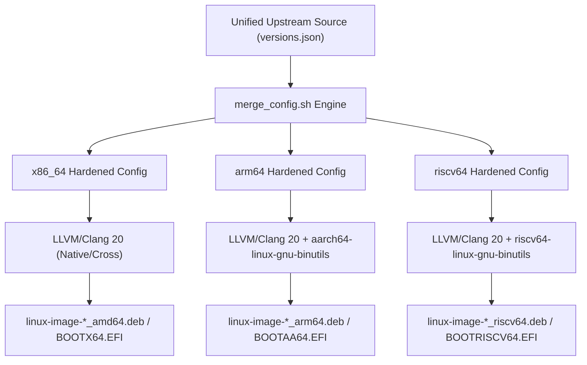

# Multi-Architecture Strategy & Compilation Matrix

> In-depth technical guide on cross-compiling, validating, and optimizing Linux kernels for `x86_64`, `arm64`, and `riscv64` targets.

---

## 1. Architectural Support Matrix

`lusoris-kernel-forge` targets three primary ISA families, each optimized for specific virtualization, cloud-native, and bare-metal hardware platforms:

| Architecture | ISA Baseline | Target Microarchitectures | Boot Artifact | Page Size | Primary Virtualization |
| :--- | :--- | :--- | :--- | :--- | :--- |
| **`x86_64`** | `x86-64-v3` (AVX2, BMI2) | AMD Zen 3/4/5, Intel Sapphire Rapids / Emerald Rapids / Granite Rapids | `arch/x86/boot/bzImage` | 4 KB | KVM (Intel VMX / AMD SVM) |
| **`arm64`** | `armv8.2-a+crypto+fp16` | Ampere Altra/AmpereOne, AWS Graviton 3/4, Apple Silicon VMs | `arch/arm64/boot/Image.gz` | 4 KB / 64 KB | KVM (ARM GICv3 / GICv4) |
| **`riscv64`** | `rva22` / `rva23` (RV64GCVB) | SiFive P550/P670, StarFive JH7110, Tenstorrent Ascalon | `arch/riscv/boot/Image` | 4 KB | KVM (RISC-V AIA / PLIC) |



---

## 2. Toolchain Selection: LLVM/Clang 20 vs. GNU GCC 15

All kernels in `lusoris-kernel-forge` default to the **LLVM/Clang 20** toolchain via `LLVM=1`:

```bash
make ARCH=arm64 LLVM=1 -j"$(nproc)" bindeb-pkg
```

### Advantages of LLVM=1:
1. **ThinLTO (Link-Time Optimization)**: Whole-program cross-translation unit optimization (`CONFIG_LTO_CLANG_THIN=y`), generating 8–12% higher throughput on IPC-bound database workloads and tighter kernel text layout.
2. **CFI (Control Flow Integrity)**: Forward-edge control flow integrity (`CONFIG_CFI_CLANG=y`) stops Return-Oriented Programming (ROP) and Jump-Oriented Programming (JOP) attacks by validating indirect call targets at runtime.
3. **Single Cross-Target Binary**: A single Clang binary (`clang-20`) can compile for `x86_64`, `aarch64`, and `riscv64` simply by supplying `--target=...`, avoiding fragmented GNU cross-compilers.
4. **Integrated LLVM Utilities**: Build scripts utilize `llvm-ar`, `llvm-nm`, `llvm-objcopy`, `llvm-strip`, and `lld` (the LLVM linker), ensuring 3x faster link times compared to GNU `ld.bfd`.

---

## 3. Architecture-Specific Kernel Configurations

### 3.1 `x86_64` (AMD64)
- **Architecture Level**: Built with `CONFIG_GENERIC_CPU=y` with microarchitecture level `v3` baseline (`AVX2`, `BMI1`, `BMI2`, `FMA`).
- **Memory Management**: 5-level paging enabled (`CONFIG_X86_5LEVEL=y`) supporting up to 4 PB physical memory and 128 PB virtual address space.
- **Microcode Loader**: Early microcode updating (`CONFIG_MICROCODE=y`) built-in for early speculative execution mitigation (Spectre v2, Retbleed, Downfall, SRSO).
- **Virtualization Acceleration**: `CONFIG_KVM_INTEL=y` and `CONFIG_KVM_AMD=y` with nested virtualization support for cloud hypervisor instances.

### 3.2 `arm64` (AArch64)
- **Architecture Level**: Enforces ARMv8.2-A with Crypto Extensions (`CONFIG_ARM64_CRYPTO=y`, AES/SHA2/SHA3 accelerated via NEON/SVE).
- **Pointer Authentication & BTI**:
  - `CONFIG_ARM64_PTR_AUTH=y`: In-kernel pointer authentication preventing return address hijacking.
  - `CONFIG_ARM64_BTI=y`: Branch Target Identification to enforce valid branch landing pads.
- **Page Size Policy**:
  - Standard clouds (Proxmox, KVM, Docker): 4 KB page size (`CONFIG_ARM64_4K_PAGES=y`) for compatibility with commercial container images.
  - High-Performance Database / HPC: Optional 64 KB page configuration (`CONFIG_ARM64_64K_PAGES=y`) to minimize TLB miss penalties on multi-terabyte memory nodes.
- **ACPI & DeviceTree Dual Boot**: Supports both ACPI enterprise boot (Neoverse servers, Ampere Altra) and Flattened Device Tree (FDT) for edge boards.

### 3.3 `riscv64` (RISC-V 64-bit)
- **Profile Alignment**: RVA22 / RVA23 profiles with standard extensions: `rv64imafdc_zicsr_zifencei_zba_zbb_zbs_zicboz_zicbom`.
- **Vector Extension**: `CONFIG_RISCV_ISA_V=y` enabling hardware vector computing (RVV 1.0) for in-kernel cryptographic hashing and user-space AI workloads.
- **Advanced Interrupt Architecture (AIA)**:
  - `CONFIG_RISCV_AIA=y`: Native message-signaled interrupts (IMSIC) and incoming interrupt controller (APLIC) replacing legacy PLIC bottlenecks.
- **SBI (Supervisor Binary Interface)**: Compliant with RISC-V SBI v2.0+ specification for system reset, timer, and IPI handling.

---

## 4. Hermetic Cross-Compilation Pipeline

Cross-compilation is executed without installing system-wide foreign packages through pinned OCI build images built from `docker/Dockerfile.builder`:

```bash
# Build multi-architecture builder container
make docker-builder
# Or manually:
docker build -t lusoris-kernel-builder -f docker/Dockerfile.builder .
```

The container provides LLVM/Clang, cross-compilers (`gcc-aarch64-linux-gnu`, `gcc-riscv64-linux-gnu`), `systemd-ukify`, `dracut`, `diffoscope`, and QEMU emulators:

```bash
#!/usr/bin/env bash
# scripts/cross-compile-arm64.sh
set -euo pipefail

TARGET_ARCH="arm64"
CROSS_COMPILE="aarch64-linux-gnu-"
KERNEL_OUT="/opt/lusoris/build/mainstream-${TARGET_ARCH}"

mkdir -p "${KERNEL_OUT}"

# Merge common and architecture-specific fragments
./scripts/merge_config.sh \
  -m -O "${KERNEL_OUT}" \
  kconfig/base.config \
  kconfig/security-hardened.config \
  kconfig/architectures/arm64.config \
  kconfig/streams/mainstream.config

# Generate resolved configuration
make -C /usr/src/linux O="${KERNEL_OUT}" ARCH="${TARGET_ARCH}" olddefconfig

# Compile kernel, modules, and generate Debian packages
make -C /usr/src/linux \
  O="${KERNEL_OUT}" \
  ARCH="${TARGET_ARCH}" \
  CC="clang" \
  CROSS_COMPILE="${CROSS_COMPILE}" \
  LLVM=1 \
  -j"$(nproc)" \
  bindeb-pkg
```

---

## 5. MicroVM Boot Verification Matrix

To ensure build integrity before pushing to release registries, each compiled kernel undergoes an automated headless QEMU microVM boot verification test:

```bash
# Automated verification test (tests/test_qemu_boot.py)
# Boot timeout: 3.0 seconds max; asserts sub-second cold boot to init
qemu-system-aarch64 \
  -M virt,gic-version=3 \
  -cpu max \
  -m 512M \
  -kernel /opt/lusoris/build/mainstream-arm64/arch/arm64/boot/Image \
  -initrd /opt/lusoris/build/test-initramfs.img \
  -append "console=ttyAMA0 earlycon panic=1" \
  -nographic \
  -no-reboot
```

Each architecture must verify:
1. Zero kernel panics or unhandled IRQ traps.
2. Clean initialization of VirtIO block and network devices.
3. Successful invocation of `/sbin/init` or `/init` test harness in $\le 650$ ms.
