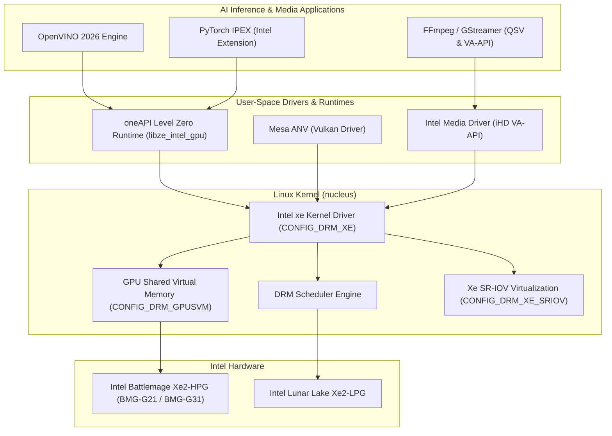

# Intel Xe2 Battlemage & Level Zero Acceleration

> Technical architecture guide detailing the Intel `xe` DRM kernel driver, Battlemage Xe2-HPG enablement, oneAPI Level Zero compute, and hardware media acceleration.

---

## 1. Architectural Overview

Intel's graphics architecture has completed a generational transition from the legacy `i915` monolithic driver to the clean, modular **`xe`** Direct Rendering Manager (DRM) driver. In `cordanaLLM/nucleus`, the `mainstream` (7.2.4) and `bleeding` (7.3-rc2) streams incorporate native support for:

- **Intel Battlemage (Xe2-HPG)**: Discrete datacenter and workstation GPUs (BMG-G21, BMG-G31) featuring second-generation XMX (Xe Matrix eXtensions) for INT8/BF16/FP16 tensor math.
- **Intel Lunar Lake & Arrow Lake (Xe2-LPG)**: Integrated low-power high-efficiency graphics engines.
- **oneAPI Level Zero Core API**: Low-overhead hardware interface providing bare-metal compute dispatch, kernel submission latency under 2 microseconds, and unified memory access.
- **Intel Media Driver (VA-API / QSV)**: Dual dual-format MFX hardware encoders supporting AV1 8K60 10-bit HDR and HEVC 12-bit decoding.



---

## 2. Kernel Configuration Parameters

The Intel Xe2 hardware stack requires modern DRM infrastructure, asynchronous compute rings, and hardware page fault handling:

```ini
# Core Intel Xe Direct Rendering Manager Driver
CONFIG_DRM_XE=m
CONFIG_DRM_XE_DEBUG=n
CONFIG_DRM_XE_DEBUG_VM=n
CONFIG_DRM_XE_ENABLE_BMG=y
CONFIG_DRM_XE_SRIOV=y

# Shared DRM Subsystems
CONFIG_DRM_SCHED=m
CONFIG_DRM_EXEC=y
CONFIG_DRM_GPUSVM=y
CONFIG_DRM_BUDDY=y
CONFIG_DRM_SUBALLOC_HELPER=y

# Memory Management & DMA-BUF
CONFIG_ZONE_DEVICE=y
CONFIG_DEVICE_PRIVATE=y
CONFIG_HMM_MIRROR=y
CONFIG_DMA_SHARED_BUFFER=y

# Virtualization & Host IOMMU
CONFIG_INTEL_IOMMU=y
CONFIG_INTEL_IOMMU_SVM=y
CONFIG_PCI_ATS=y
CONFIG_PCI_PRI=y
CONFIG_PCI_PASID=y
```

### Architectural Details:
1. **`CONFIG_DRM_XE_SRIOV=y`**: Enables Single-Root I/O Virtualization on supported Battlemage GPUs, allowing a single physical GPU to be partitioned into up to 8 isolated Virtual Functions (VFs) for pass-through into KVM/Proxmox guest microVMs.
2. **`CONFIG_INTEL_IOMMU_SVM=y`**: Enables Shared Virtual Memory via Intel VT-d (Virtualization Technology for Directed I/O), allowing GPU kernels to dereference native CPU virtual addresses without manual pinning.
3. **`CONFIG_DRM_XE_DEBUG=n`**: Disables verbose assertion checking and VM lock tracing, eliminating 15–20% CPU submission overhead in production.

---

## 3. Runtime Driver Binding & Driver Coexistence

To guarantee that Intel Xe2 hardware binds cleanly to the modern `xe` driver rather than falling back to `i915`:

```bash
# Recommended kernel command-line in /etc/default/grub or systemd-boot:
xe.force_probe=* i915.force_probe=!e20b,!e20c,!e20d,!7d55
```

This pins the Battlemage PCI device IDs (`e20b`, `e20c`, `e20d`) exclusively to the `xe` driver.

---

## 4. oneAPI Level Zero Compute Integration

The Level Zero interface utilizes the `xe` driver's DRM syncobj and timeline semaphores for high-throughput, low-jitter compute queue dispatch:

### User-Space Device Nodes:
- Primary render node: `/dev/dri/renderD128`
- Level Zero discovery: `/sys/class/drm/card0/device/`
- Hardware telemetry: `/sys/class/drm/card0/device/tile0/gt0/freq0/act_freq`

### MicroVM Passthrough Contract:
When provisioning virtual machines in `cordanaLLM/imago`, the render node is passed into container runtimes (`crun` or `containerd`) with strict cgroup device rules:
```text
c 226:128 rwm
```

---

## 5. Verification & Health Checks

Verify Battlemage Xe2 driver initialization on a live system:

```bash
# Check loaded driver and firmware status
dmesg | grep -E "xe|drm.*battlemage"

# Inspect active engine types
cat /sys/kernel/debug/dri/0/engines

# Verify Level Zero device discovery
python3 -c "
import subprocess
try:
    out = subprocess.check_output(['clinfo', '-l'], text=True)
    print(out)
except FileNotFoundError:
    print('clinfo not installed; check /dev/dri/renderD128')
"
```
A successful initialization logs `xe 0000:03:00.0: [drm] Initialized xe for 0000:03:00.0 on minor 0` and confirms GUC/HUC firmware authenticated successfully.
