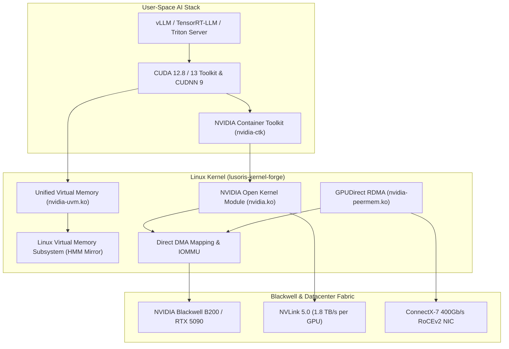

# NVIDIA Blackwell B200, RTX 5090 & CUDA 12.8/13 Acceleration

> Authoritative engineering specification for NVIDIA Open Kernel Modules, Blackwell (B200 / RTX 5090) Day-0 enablement, CUDA 12.8/13 unified memory, and GPUDirect RDMA.

---

## 1. Architectural Evolution: NVIDIA Open Kernel Modules

The NVIDIA GPU computing architecture on Linux has transitioned to open-source kernel modules (`nvidia.ko`, `nvidia-modeset.ko`, `nvidia-drm.ko`, `nvidia-uvm.ko`), licensed under dual MIT/GPLv2:

- **Legacy Architectures (Volta/Turing)**: Maintained on the 535.x LTS branch for older enterprise infrastructure.
- **Production Enterprise (Ada Lovelace / Hopper)**: Powered by the 565.x driver series across H100, H200, GH200 Grace Hopper, and RTX 4090 hosts.
- **Bleeding Edge (Blackwell Microarchitecture)**: Supported by the 615.x driver family in the `bleeding` (7.3-rc2) stream for B100, B200, GB200 NVL72 rack systems, and consumer GeForce RTX 5090 / 5080 hardware.



---

## 2. Kernel Configuration Baseline for NVIDIA Acceleration

To compile and execute NVIDIA Open Kernel Modules without symbol mismatches or memory fragmentation, the following options are enforced across `kconfig/drivers/nvidia.config`:

```ini
# Core PCI, PAT and Memory Management
CONFIG_PCI_MSI=y
CONFIG_X86_PAT=y
CONFIG_MTRR=y
CONFIG_ZONE_DEVICE=y
CONFIG_DEVICE_PRIVATE=y
CONFIG_HMM_MIRROR=y
CONFIG_MIGRATION=y

# DMA and DRM Invariants
CONFIG_DMA_SHARED_BUFFER=y
CONFIG_SYNC_FILE=y
CONFIG_DRM=m
CONFIG_DRM_KMS_HELPER=m

# GPUDirect RDMA & InfiniBand Peer-to-Peer
CONFIG_INFINIBAND=m
CONFIG_INFINIBAND_USER_ACCESS=m
CONFIG_INFINIBAND_USER_MEM=y
CONFIG_PCI_P2PDMA=y

# MicroVM Virtualization & KVM Passthrough
CONFIG_VFIO=m
CONFIG_VFIO_PCI=m
CONFIG_VFIO_IOMMU_TYPE1=m
CONFIG_IOMMU_SUPPORT=y
CONFIG_INTEL_IOMMU=y
CONFIG_AMD_IOMMU=y
```

### Critical Rationale:
1. **`CONFIG_HMM_MIRROR=y` & `CONFIG_DEVICE_PRIVATE=y`**: Enables the CUDA Unified Virtual Memory (UVM) driver to transparently migrate memory pages between physical system DDR5/LPDDR5 memory and GPU HBM3e/GDDR7 memory upon hardware page fault.
2. **`CONFIG_PCI_P2PDMA=y` & `CONFIG_INFINIBAND_USER_MEM=y`**: Prerequisite for `nvidia-peermem`, allowing high-speed NICs (Mellanox ConnectX-6/7/8) to directly read and write GPU memory over PCIe/NVLink without copying buffers through system RAM.

---

## 3. CUDA 12.8 / 13 Features on Blackwell

The Blackwell architecture introduces major hardware breakthroughs enabled by the `bleeding` kernel stream:

### 3.1 Second-Generation Transformer Engine (FP4 & Microscaling)
Blackwell integrates native 4-bit floating point (NVFP4) and microscaling formats with hardware decompression, doubling token generation throughput over Hopper. The kernel UVM driver allocates contiguous 2 MB physical pages to maximize TLB coverage for high-dimensional tensor weights.

### 3.2 NVLink 5.0 Fabric & Multi-Node Scaling
- Delivers up to 1.8 TB/s bidirectional bandwidth per GPU.
- Supports 576 GPUs interconnected in a single NVLink cluster domain (GB200 NVL72).
- The kernel exposes the NVLink management interface via `/dev/nvidia-caps/nvidia-cap*` device nodes with fine-grained POSIX access control.

### 3.3 Enhanced Multi-Instance GPU (MIG)
Blackwell allows hardware partitioning of a single physical B200 GPU into up to 7 isolated GPU instances, each with dedicated high-bandwidth memory controllers, cache slices, and compute engines:
```bash
# Example: Configuring 7x 1g.24gb MIG instances on B200
nvidia-smi -i 0 -mig 1
nvidia-smi mig -cgi 19,19,19,19,19,19,19 -C
```

---

## 4. Kernel Module Runtime Parameters

To maximize inference performance, prevent PCIe ASPM power state latency, and ensure reliable persistence in container nodes:

```bash
# /etc/modprobe.d/nvidia.conf
options nvidia \
  NVreg_OpenRmEnableUnsupportedGpus=1 \
  NVreg_PreserveVideoMemoryAllocations=1 \
  NVreg_TemporaryFilePath=/var/tmp \
  NVreg_EnablePCIeGenSpeed=5

options nvidia_uvm \
  uvm_perf_prefetch_enable=1 \
  uvm_perf_fault_coalesce=1
```

| Parameter | Function & Operational Value |
| :--- | :--- |
| `NVreg_OpenRmEnableUnsupportedGpus=1` | Allows the open kernel module to initialize non-datacenter Blackwell GPUs (e.g. GeForce RTX 5090) |
| `NVreg_PreserveVideoMemoryAllocations=1` | Saves VRAM allocations across power transitions, preventing pod eviction during sleep/resume cycles |
| `uvm_perf_prefetch_enable=1` | Enables hardware-guided proactive memory prefetching across NVLink interconnects |
| `uvm_perf_fault_coalesce=1` | Coalesces concurrent GPU memory page faults into batched TLB invalidation operations |

---

## 5. Verification & Diagnostics

To verify the open kernel module installation and hardware health:

```bash
# Verify kernel module origin and license
modinfo nvidia | grep -E "filename|license|version"

# Validate GPUDirect RDMA peermem binding
lsmod | grep -E "nvidia_peermem|ib_core"

# Check device node creation and permissions
ls -l /dev/nvidia* /dev/nvidia-uvm*

# Run hardware device query
nvidia-smi -q -d MEMORY,UTILIZATION,ECC
```
A correctly configured system indicates `License: Dual MIT/GPL` in `modinfo nvidia` and displays zero ECC double-bit errors.
