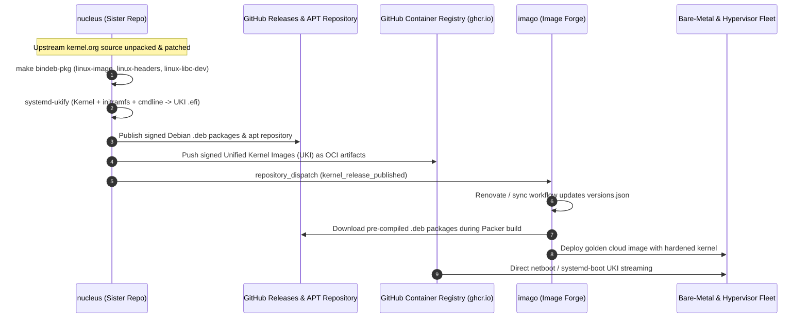

# nucleus

> Enterprise-grade, hardened, hardware-accelerated Linux kernel compilation and packaging factory for `cordanaLLM/imago` and high-performance bare-metal clusters.

---

## 1. Mission & Ecosystem Architecture

`cordanaLLM/nucleus` is the dedicated kernel compilation sister repository to [`cordanaLLM/imago`](https://github.com/cordanaLLM/imago). 

In traditional cloud image builds, compiling custom Linux kernels directly inside Packer or Image Builder virtual machines introduces severe bottlenecks: multi-hour build cycles, CPU resource exhaustion, duplicate compilation across matrix variants, and brittle compiler toolchain setup. `cordanaLLM/nucleus` solves this by decoupling kernel compilation into a dedicated, hermetic build pipeline.

The repository compiles, patches, hardens, and packages four production kernel streams across **`x86_64` (AMD64)**, **`arm64` (aarch64)**, and **`riscv64`** architectures. The output artifacts—native Debian packages (`.deb`) and signed systemd-boot Unified Kernel Images (`.efi`)—are published to an authenticated APT repository and OCI registry, then consumed downstream by `cordanaLLM/imago`.



---

## 2. Live Kernel Release Streams

All versions, upstream source tarball URLs, and release tags are managed exclusively through [`versions.json`](https://github.com/cordanaLLM/nucleus/blob/main/versions.json).

| Stream | Linux Version | Status | Primary Target Workloads | Hardware Acceleration | Key Features |
| :--- | :--- | :--- | :--- | :--- | :--- |
| **`bleeding`** | `7.3-rc2` | Mainline | Next-gen AI clusters, high-frequency eBPF | NVIDIA Blackwell B200 / RTX 5090, CXL 3.0 | `sched-ext` dynamic scheduler, PCIe 6.0, cutting-edge DRMs |
| **`mainstream`** | `7.2.4` | Stable | Production container hosts, virtualization | Intel Battlemage Xe2, AMD ROCm 10, NVIDIA 565/610 | BBRv3 congestion control, VirtIO `mq-deadline`, Level Zero |
| **`lts`** | `6.18.50` | Longterm | Enterprise Kubernetes nodes, OpenZFS storage | NVIDIA LTS drivers, Intel Arc Alchemist | Rock-solid stability, OpenZFS 2.3+ kmod stability, strict overcommit |
| **`realtime`** | `7.2-rt` | PREEMPT_RT | Low-jitter game servers, edge gateways | Low-latency audio & SDR hardware | Full preemptible kernel (`PREEMPT_RT`), 1000Hz timer, threaded IRQs |

---

## 3. Core Architectural Pillars

- **Single Source of Truth (SSOT)**: Kernel versions, upstream archives, patch queues, and architecture targets are strictly declared in [`versions.json`](https://github.com/cordanaLLM/nucleus/blob/main/versions.json) and validated by JSON Schema.
- **NASA / JPL Power of 10 Compliance**: All automation and build scripts enforce `set -euo pipefail`, short functions ($\le 60$ lines), localized variables, bounded control loops, and zero ShellCheck warnings.
- **Modular KConfig Architecture**: Kernel configurations are partitioned into composable fragments (`base/`, `security/`, `drivers/`, `streams/`), merged deterministically with `merge_config.sh`.
- **Zero-Leak Invariant**: Codebase is protected against private network leaks (zero RFC 1918 addresses) and local workstation paths (zero `/home/...` or `/Users/...` references).
- **Dual Packaging Engine**: Standard Debian packages (`.deb`) for apt-based distributions and systemd Unified Kernel Images (`.efi`) for authenticated secure boot and bare-metal streaming.

---

## 4. Quickstart Recipes

### Inspecting Configured Streams
Validate the declarative manifest and list available build channels:
```bash
make lint
python3 -c "import json; data=json.load(open('versions.json')); print(json.dumps(data['streams'], indent=2))"
```

### Dry-Run Kernel Build Pipeline
Verify downloading, unpacking, patch application, and configuration merging without invoking compiler threads:
```bash
./scripts/build-kernel.sh mainstream x86_64 --dry-run
```

### Building Full Debian Kernel Packages
Execute compilation using LLVM/Clang or GCC with all available host cores:
```bash
./scripts/build-kernel.sh mainstream x86_64
```
Compiled Debian packages will be placed into `output/mainstream-x86_64/`:
- `linux-image-7.2.4-lusoris1_amd64.deb`
- `linux-headers-7.2.4-lusoris1_amd64.deb`
- `linux-libc-dev-7.2.4-lusoris1_amd64.deb`

### Synthesizing Unified Kernel Images (UKI)
Generate an authenticated, self-contained single EFI binary containing kernel, initramfs, CPU microcode, and kernel command line:
```bash
./scripts/package-uki.sh mainstream x86_64
```

### Running Test Gates
Ensure all kconfig fragments, shell scripts, and privacy invariants pass validation:
```bash
make test
```
