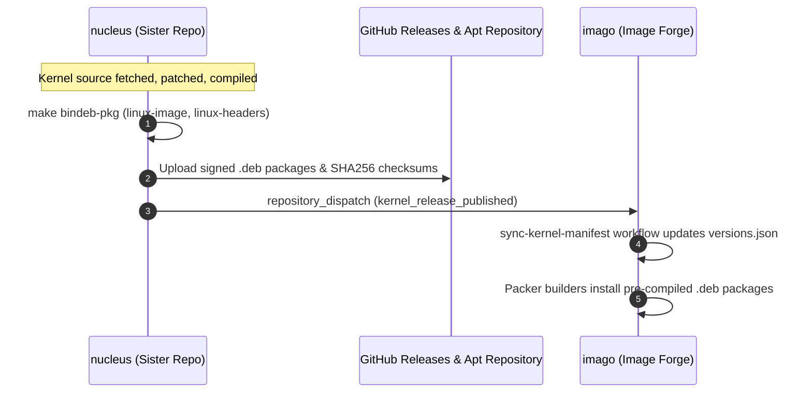

# Onboarding & Agent Migration Runbook

> Authoritative runbook for autonomous AI coding agents and human contributors onboarding or executing migrations in `cordanaLLM/nucleus`.

---

## 0. Start here

**This forge does not compile a kernel yet.** `scripts/build_kernel.sh` refuses on its
production path and exits 1; only `--dry-run` produces output. Everything around the
compile is implemented: the manifest, the kconfig merge, the packaging scripts, the
release pipeline with SBOM and cosign signature, and the downstream dispatch to
`cordanaLLM/imago`.

It refuses because it used to fabricate. The production path touched two empty `.deb`
files and exited 0, the release workflow added sixteen megabytes of `/dev/urandom` named
as a Unified Kernel Image, and cosign signed the result. Imago verifies these artifacts
by digest and provenance before an image consumes them, and that verification would have
passed on empty files.

The work is issue #18: fetch the pinned tarball, verify it, merge the kconfig fragments,
run `bindeb-pkg`, and cross-compile for `arm64` and `riscv64`. `AGENTS.md` section 1 has
the stage-by-stage state and the contract with imago.

---

## 1. System Role & Ecosystem Topology

`cordanaLLM/nucleus` is the kernel compilation sister repository to `cordanaLLM/imago`. 

Instead of compiling kernels inside image builders (which slows down Packer and wastes CI compute), `cordanaLLM/nucleus` compiles, patches, and packages standardized `.deb` packages for four discrete release channels across `x86_64`, `arm64`, and `riscv64`.



---

## 2. Agent Migration Orders & Initial Execution Checklist

When an autonomous agent is initialized in or migrated to this repository, it must execute the following sequential orders:

### Order 1: Verify Environment & Tools
Verify that the host environment has GNU Make, Python 3.12+, ShellCheck, Yamllint, and kernel build utilities:
```bash
make --version
python3 --version
shellcheck --version
yamllint --version
```

### Order 2: Validate Manifest & Invariants
Run the local quality gates:
```bash
make lint
make test
```
Confirm:
- `versions.json` matches `versions.schema.json`.
- Zero private RFC 1918 IPs exist across the codebase.
- Zero developer workstation paths exist across the codebase.

### Order 3: Inspect Stream Targets in `versions.json`
Verify the target kernel streams:
- `bleeding`: Linux 7.3-rc2
- `mainstream`: Linux 7.2.4
- `lts`: Linux 6.18.50
- `realtime`: Linux 7.2-rt

---

## 3. Operational Recipes

### Recipe A: Compiling a Kernel Locally
```bash
# Dry-run validation of download and config merge:
./scripts/build_kernel.sh --stream=mainstream --arch=x86_64 --dry-run

# Full compilation (utilizes all available CPU threads):
./scripts/build_kernel.sh --stream=mainstream --arch=x86_64
```

### Recipe B: Adding a Curated Kernel Patch
1. Create a descriptive patch file under `patches/<stream>/` or `patches/common/`:
   ```bash
   # Example: patches/common/0002-bbrv3-congestion-tuning.patch
   ```
2. Verify that the patch applies cleanly against the unpacked kernel source:
   ```bash
   patch -p1 --dry-run < patches/common/0002-bbrv3-congestion-tuning.patch
   ```
3. Commit adhering to Conventional Commits: `feat(patches): add bbrv3 congestion tuning patch for mainstream`.

### Recipe C: Bumping a Kernel Version
1. Edit [`versions.json`](https://github.com/cordanaLLM/nucleus/blob/main/versions.json) with the new version, tag, and upstream tarball URL.
2. Update [`docs/streams.md`](streams.md) and [`README.md`](https://github.com/cordanaLLM/nucleus/blob/main/README.md) in the exact same commit.
3. Validate schema: `make lint && make test`.
4. Submit PR via short-lived branch (`chore/bump-<stream>-kernel`).

---

## 4. Compliance & Invariant Guardrails

1. **Zero-Leak Invariant**:
   - Never commit RFC 1918 IP addresses (`10.x`, `192.168.x`, `172.16-31.x`).
   - Never commit `/home/...` or `/Users/...` workstation paths.
   - Always verify with `pytest tests/test_security_privacy.py`.
2. **NASA/JPL Power of 10**:
   - Keep shell functions under 60 lines.
   - Enforce `set -euo pipefail`.
   - Always verify with `shellcheck -s bash scripts/*.sh`.
