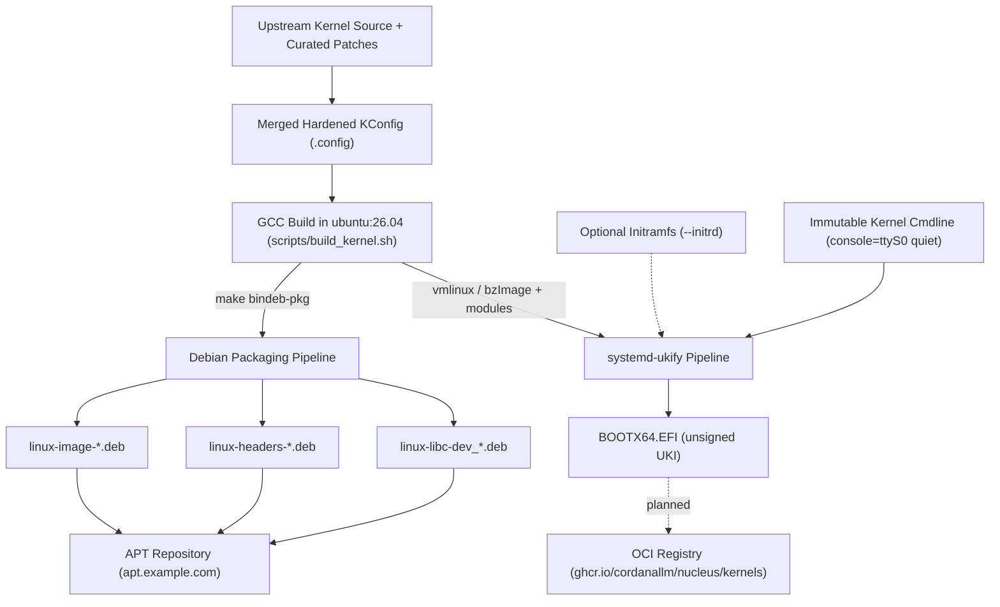

# Kernel Packaging & Delivery Architecture

> Authoritative engineering guide covering Debian `bindeb-pkg` compilation, systemd-ukify Unified Kernel Image (UKI) synthesis, initramfs contracts, and OCI distribution.

---

## 1. Overview & Dual Packaging Strategy

`cordanaLLM/nucleus` delivers compiled kernels through two complementary delivery formats:

1. **Standard Debian Packages (`.deb`)**, named `<package>_<version>-lusoris<N>_<debian arch>.deb`
   (section 2.2):
   - `linux-image-<kernelrelease>`: the compressed kernel (`/boot/vmlinuz-<kernelrelease>`), its
     configuration (`/boot/config-<kernelrelease>`), `System.map`, the stripped modules
     (`/lib/modules/<kernelrelease>`) and, on arm64 and riscv64, the device trees.
   - `linux-headers-<kernelrelease>`: headers and host programs for out-of-tree modules (DKMS).
     Built on x86_64 and arm64, not on the cross-compiled riscv64 (section 2.3).
   - `linux-libc-dev`: the kernel's user-space API headers.
   - Designed for standard Debian/Ubuntu OS installations, container base hosts, and golden image provisioning in `cordanaLLM/imago`.

2. **Unified Kernel Images (UKI, `.efi`)**:
   - Single, self-contained, unsigned UEFI PE binary combining the systemd-stub, the Linux kernel (`.linux`), the kernel command line (`.cmdline`), and OS release, kernel release and SBAT metadata (`.osrel`, `.uname`, `.sbat`). An initramfs (`.initrd`) is embedded only when one is passed; no CPU microcode is embedded (section 3.1).
   - Designed for UEFI boot and direct network streaming (iPXE / systemd-boot). Secure Boot signing and TPM 2.0 PCR 11 pre-calculation are planned and not wired yet (sections 3.2 and 3.4).



---

## 2. Native Debian Packaging (`bindeb-pkg`)

`scripts/build_kernel.sh` compiles one stream for one architecture into Debian packages with the
kernel's own `bindeb-pkg` target ([ADR-0009](adr/0009-kernel-compilation-and-artifact-gate.md)).
It starts from two inputs, both produced before anything compiles
([ADR-0008](adr/0008-signed-kernel-sources-and-resolved-configuration.md)):

1. **A verified source tree**: `scripts/fetch-kernel-source.sh --stream=<stream> --dest=<dir>`
   checks the pinned `sha256` and the kernel.org signature of a tarball, or `git verify-tag` and
   the pinned commit of a release-candidate tag, and refuses otherwise. `build_kernel.sh` runs it
   unless `--source-tree` names a tree it already verified.
2. **A resolved configuration**: `scripts/merge-config.sh --stream=<stream> --arch=<arch>
   --source-tree=<dir>` applies the architecture defconfig, the fragments and `make
   olddefconfig`, refuses when a requested value did not survive, and writes
   `kernel-<stream>-<arch>.config`. Its build directory is the `O=` directory of the compile.

```bash
# A verified tree, then one leg; the output directory must be empty or absent
./scripts/fetch-kernel-source.sh --stream=mainstream --dest=build/linux-mainstream
./scripts/build_kernel.sh --stream=mainstream --arch=x86_64 --source-tree=build/linux-mainstream
make build-kernel STREAM=mainstream ARCH=x86_64 DRY_RUN=false SOURCE_TREE=build/linux-mainstream

# State what a build would do, without fetching, compiling or writing anything
./scripts/build_kernel.sh --stream=bleeding --arch=riscv64 --dry-run
```

The result is `output/<stream>-<arch>/` holding exactly the packages, `vmlinuz-<kernelrelease>`
(extracted from the image package) and `kernel-<stream>-<arch>.config`, and a build record
`build/<stream>-<arch>/build.json` with the kernelrelease, the package version, the profiles, the
build time and the configuration's digest. The compiler's output goes to
`build/<stream>-<arch>/build.log`; on failure its last 60 lines are printed. Options:
`--work-dir` (default `build`), `--output-dir` (default `output/<stream>-<arch>`), `--revision`
(default 1, section 2.2) and `--jobs` (default `nproc`).

### 2.1 Invocation & Environment Controls

The compile is this, with the values `versions.json` gives for the stream and architecture:

```bash
DEB_BUILD_PROFILES="pkg.linux-upstream.nokerneldbg" \
make -C build/linux-mainstream O=build/mainstream-x86_64/kbuild \
  ARCH=x86_64 CROSS_COMPILE=x86_64-linux-gnu- \
  LOCALVERSION=-lusoris1-mainstream KDEB_PKGVERSION=7.2.8-lusoris1 \
  -j"$(nproc)" bindeb-pkg
```

The build carries no clock and no builder identity:

| Variable | Value | Why |
| :--- | :--- | :--- |
| `SOURCE_DATE_EPOCH` | the modification time of the tree's `Makefile` | `git archive`, which makes kernel.org's tarballs and the git-tag export alike, stamps every file with the release commit's time |
| `KBUILD_BUILD_TIMESTAMP` | that time as a `date` string, for example `Fri Sep 25 14:37:14 UTC 2026` | the timestamp in `uname -v` |
| `KBUILD_BUILD_USER`, `KBUILD_BUILD_HOST` | `nucleus`, `forge` | the `(nucleus@forge)` in the boot banner |
| `LC_ALL`, `TZ` | `C`, `UTC` | locale- and zone-independent tool output |

`CROSS_COMPILE` is set on every host, the native one included, so the configuration records the
same compiler wherever it is built: Ubuntu 26.04's native and cross compilers both report
`(Ubuntu 15.2.0-16ubuntu1) 15.2.0`. The kernel's `debian/rules` sets `KBUILD_BUILD_VERSION` to the
package revision, so `uname -v` reads `#lusoris1 SMP PREEMPT_DYNAMIC Fri Sep 25 14:37:14 UTC 2026`.

The build installs files with GNU `install`. Ubuntu 26.04's `/usr/bin/install` is uutils coreutils,
whose `install -D` fails when parallel calls create the same directory, as the device-tree install
of every arm64 and riscv64 build does. Ubuntu keeps GNU `install` as `gnuinstall`
(`gnu-coreutils`), so when `install` is not GNU, `build_kernel.sh` links
`build/<stream>-<arch>/gnu-install/install` to `gnuinstall` and puts that directory first on the
build's `PATH`; with neither, it refuses. Replacing uutils altogether is not an option there:
`build-essential` depends on it, and `bindeb-pkg` checks the build dependencies.

The modules are signed at build time with a key generated for that build
(`CONFIG_MODULE_SIG_ALL`); the key stays in the build tree, which CI discards. Two builds of one
tag therefore differ in their module signatures.

### 2.2 Localversion & Package Naming Contract

| | Form | `mainstream` |
| :--- | :--- | :--- |
| `LOCALVERSION` | `-lusoris<N>-<stream>` | `-lusoris1-mainstream` |
| kernelrelease (`uname -r`) | `<kernelversion>-lusoris<N>-<stream>` | `7.2.8-lusoris1-mainstream` |
| package version (`KDEB_PKGVERSION`) | `<version>-lusoris<N>` | `7.2.8-lusoris1` |
| image package file | `linux-image-<kernelrelease>_<package version>_<debian arch>.deb` | `linux-image-7.2.8-lusoris1-mainstream_7.2.8-lusoris1_amd64.deb` |

The other streams are `7.3.0-rc5-lusoris1-bleeding` (package version `7.3-rc5-lusoris1`),
`6.18.54-lusoris1-lts` and `7.2.8-lusoris1-realtime`. The Debian architecture comes from
`architectures.<arch>.debian_arch` in `versions.json` (`amd64`, `arm64`, `riscv64`). `<N>` is the
forge revision, `--revision`; the release workflow passes the one its tag names (section 5.4).

The localversion keeps these packages from colliding with distribution kernels
(`linux-image-generic`, `linux-image-amd64`), and it is what tells `mainstream` and `realtime`
apart: both are built from the same 7.2.8 tree, whose `make kernelrelease` is `7.2.8` for either
without one.

### 2.3 Debug Symbols, Headers and Cross Builds

- The debug-symbol package is not built: every build uses the `pkg.linux-upstream.nokerneldbg`
  profile. The kernel keeps its DWARF-derived BTF (`CONFIG_DEBUG_INFO_BTF`), which eBPF needs,
  and the modules are installed stripped (`INSTALL_MOD_STRIP=1`, set by the kernel's
  `scripts/package/builddeb`).
- A build whose host architecture differs from its target adds
  `pkg.linux-upstream.nokernelheaders` and ships no headers package. The headers package rebuilds
  its host programs with the target compiler, `sign-file` among them, which links the target's
  `libcrypto`; a cross build has none. In `build-matrix.yml`, x86_64 and arm64 build natively
  (arm64 on the hosted `ubuntu-24.04-arm` runner) and riscv64 cross-compiles.

In `build-matrix.yml` on the 4-vCPU hosted runners, with a cold compiler cache, an x86_64 compile
took 1029 to 1208 s, a riscv64 compile 1023 to 1572 s and a native arm64 compile 2087 to 2250 s
(runs 36504114874 and 36507112520); a whole leg took 18 to 22 minutes on x86_64, boot included,
and up to 40 minutes on arm64. With the cache the x86_64 and riscv64 compiles took 47 to 114 s.

Measured sizes of the local builds (2026-09-29, `docker` `ubuntu:26.04` on an x86_64 host, 32
threads, so arm64 and riscv64 were cross-compiled there and have no headers package; riscv64
carries no debug information, so it has no BTF either); imago accepts up to 512 MiB per artifact:

| Leg | image package | headers | libc-dev | `vmlinuz` | object tree | compile |
| :--- | ---: | ---: | ---: | ---: | ---: | ---: |
| bleeding, x86_64 | 21.1 MB | 11.0 MB | 1.6 MB | 19.0 MB | 5.9 GiB | 210 s |
| mainstream, x86_64 | 20.9 MB | 10.9 MB | 1.6 MB | 18.8 MB | 5.9 GiB | 181 s |
| lts, x86_64 | 20.0 MB | 10.5 MB | 1.5 MB | 18.0 MB | 5.5 GiB | 159 s |
| realtime, x86_64 | 18.8 MB | 10.9 MB | 1.6 MB | 16.9 MB | 5.1 GiB | 211 s |
| mainstream, arm64 | 43.7 MB | none | 1.5 MB | 17.5 MB | 11 GiB | 522 s |
| mainstream, riscv64 | 16.8 MB | none | 1.5 MB | 11.0 MB | 1.1 GiB | 326 s |

### 2.4 The Artifact Gate

Nothing is checksummed before `scripts/check_kernel_artifacts.py` has opened it. It runs at the end
of every build and again in `publish-release.yml` before the SBOMs, `SHA256SUMS` and the
signature, and refuses the directory unless:

- it holds only non-empty regular files: packages, `vmlinuz-<kernelrelease>` and
  `kernel-<stream>-<arch>.config`;
- `dpkg-deb -f` reads every package as `linux-image-<kernelrelease>`,
  `linux-headers-<kernelrelease>` or `linux-libc-dev`, at `<version>-lusoris<N>` and the
  architecture's `debian_arch`, under the file name `<Package>_<Version>_<Architecture>.deb`; the
  image package is present, and no package appears twice;
- the kernelrelease starts with the stream's kernel version and ends with `-lusoris<N>-<stream>`;
- the image package carries `./boot/vmlinuz-<kernelrelease>`, byte-identical to the
  `vmlinuz-<kernelrelease>` beside it, and `./boot/config-<kernelrelease>`, byte-identical to
  `kernel-<stream>-<arch>.config`.

```bash
python3 scripts/check_kernel_artifacts.py --dir=output/mainstream-x86_64 --stream=mainstream \
  --arch=x86_64 --kernelrelease=7.2.8-lusoris1-mainstream
```

Exit status 0 passes, 1 refuses and lists every finding, 2 means the request cannot be evaluated
(an unknown stream or architecture, or no `dpkg-deb`).

### 2.5 Boot Smoke Test

Every x86_64 kernel the matrix builds is booted to userspace before it is kept.
`scripts/boot_smoke.py` compiles a static `init` that prints the running kernel's release and
powers the machine off, packs it with a `/dev/console` node into a newc initramfs, and boots:

```bash
qemu-system-x86_64 -accel tcg -m 512M -smp 1 -kernel vmlinuz-<kernelrelease> \
  -initrd <initramfs> -append 'console=ttyS0 panic=-1 rdinit=/init' -nographic -no-reboot
```

It passes only when the console shows `Linux version <kernelrelease>` (followed by a space) and the init's
`NUCLEUS-BOOT-SMOKE release=<kernelrelease>` within the timeout (default 180 s). A panic ends
QEMU at once (`panic=-1` with `-no-reboot`); a hang is killed at the timeout. Locally all four
x86_64 kernels booted under TCG in 4 to 21 s.

```bash
python3 scripts/boot_smoke.py --kernel=output/mainstream-x86_64/vmlinuz-7.2.8-lusoris1-mainstream \
  --kernelrelease=7.2.8-lusoris1-mainstream --log=boot.log
make boot-smoke KERNEL=<vmlinuz> KERNELRELEASE=<release>
```

---

## 3. Unified Kernel Images (UKI) via `systemd-ukify`

A Unified Kernel Image is an executable UEFI PE binary conforming to the [UAPI Group Boot Loader Specification (Type 2)](https://uapi-group.org/specifications/specs/boot_loader_specification/).

### 3.1 UKI Section Layout

`ukify` builds the image on the systemd-stub and adds one PE section per input. Section names
follow the [UAPI Group UKI specification](https://uapi-group.org/specifications/specs/unified_kernel_image/).
This is what `scripts/package-uki.sh` produces, and what `scripts/check_uki.py` requires before
the image may be checksummed:

| PE Section Name | Contents | In the image | Checked |
| :--- | :--- | :--- | :--- |
| `.linux` | The `--vmlinuz` kernel image, unchanged | Always | Required, not empty |
| `.initrd` | The `--initrd` archive | Only when `--initrd` is given | Required if given, refused if not |
| `.cmdline` | The kernel command line text (`--cmdline`, or the script's default) | Always | Required, not empty |
| `.osrel` | os-release written from `versions.json` (`ID=lusoris`, stream version) | Always | Required, not empty |
| `.uname` | Kernel release, detected by `ukify` from the kernel image | Always | Required, not empty |
| `.sbat` | The stub's SBAT entries plus the `lusoris` entry | Always | Required, not empty |
| `.sdmagic` | The systemd-stub version marker | Always, from the stub | Required, must name systemd-stub |
| `.ucode`, `.splash`, `.dtb`, `.dtbauto`, `.efifw`, `.hwids`, `.pcrsig`, `.pcrpkey`, `.profile` | CPU microcode, boot splash, device trees, firmware, HWIDs, TPM 2.0 PCR 11 signature and key, extra profiles | Never: `package-uki.sh` passes none of them | Refused if present |

No CPU microcode is embedded, and the image is not Secure Boot signed. The refusal in the last row
is what enforces this: a section joins the image only when `package-uki.sh` is changed to wire it,
so the image does not depend on what the build host has installed or configured.

### 3.2 Synthesis with `ukify`

`build_uki_binary` in `scripts/package-uki.sh` writes the os-release, SBAT and command line inputs
to a private staging directory and calls `ukify build` with `--config=/dev/null`, `--efi-arch`,
`--linux`, `--cmdline=@<file>`, `--os-release=@<file>`, `--sbat=@<file>` and
`--output=output/<stream>-<arch>/BOOTX64.EFI` (`BOOTAA64.EFI`, `BOOTRISCV64.EFI`), plus
`--initrd` only when one was given.

- `ukify` reads a `--cmdline` value as literal text unless it starts with `@`. Without the `@`,
  the image would boot with the staging file's path as its kernel command line.
- `ukify` fails on an empty `--initrd=`, so the flag is omitted rather than passed empty.
- `ukify` reads the first `ukify.conf` it finds in `/etc/systemd`, `/run/systemd`,
  `/usr/local/lib/systemd` or `/usr/lib/systemd`, which can add microcode, device tree, splash
  or PCR signature sections or sign the image. `--config=/dev/null` stops that.
- `ukify` picks the systemd-stub by EFI architecture (`linux<efi-arch>.efi.stub`) and, without
  `--efi-arch`, uses the build host's. The script passes it (`x86_64` to `x64`, `arm64` to `aa64`,
  `riscv64` to `riscv64`), so an arm64 or riscv64 build on a host without that stub fails with an
  error that names the missing stub instead of wrapping the kernel in an x64 stub. Building
  for those architectures needs the matching stub and kernel (issue #18).
- The stub comes from `systemd-boot-efi`, which Ubuntu installs only as a recommendation of
  `systemd-ukify`. Install both on the runner.
- Secure Boot signing (`--secureboot-private-key`, `--secureboot-certificate`) and PCR 11
  pre-calculation (`--measure`, `--pcr-private-key`) are not wired yet.

### 3.3 Refusing an Image That Is Not a UKI

`scripts/package-uki.sh` runs `scripts/check_uki.py` on whatever `ukify` wrote, before
`sha256sum`. If the check fails, the script deletes the image and exits non-zero, so a
refused image never gets a checksum. The checker itself only reads the file. A production run
also removes the image, its `.sha256` and `pcr11-measurements.json` from an earlier run before
it checks any input, so a refused run leaves nothing at that path. The checker uses only the
Python standard library. It refuses a file that:

- is empty, or does not start with an `MZ` DOS header;
- has an `e_lfanew` outside the file, or no `PE\0\0` signature at it;
- has a COFF machine type other than `--arch` (`0x8664` x86_64, `0xaa64` arm64, `0x5064` riscv64);
- is not PE32 or PE32+ with subsystem EFI application (10);
- has a section table or section data that runs past the end of the file;
- lacks a section that 3.1 marks required, carries one of them twice, or carries `.initrd`
  without `--expect-initrd`;
- carries a section that `package-uki.sh` does not wire (last row of 3.1);
- holds a `.linux` kernel that starts with `MZ` but has another machine type than `--arch`, so an
  x64 stub around a kernel for another architecture is refused;
- with `--expect-cmdline`, holds a `.cmdline` other than the requested text (`package-uki.sh`
  passes the command line it wrote), so a command line that is a file path is refused.

These checks prove shape, not bootability or provenance: a deliberately crafted file with these
sections passes. They stop a failed or missing tool, or a placeholder, from being published
under a UKI name (issue #21). To check an image by hand:

```bash
python3 scripts/check_uki.py --arch=x86_64 [--expect-initrd] [--expect-cmdline=TEXT|@FILE] \
  output/mainstream-x86_64/BOOTX64.EFI
```

How this is tested:

- `tests/test_package_uki.py` runs `package-uki.sh` with a stand-in `ukify` on a `PATH` that
  holds nothing else, so the result does not depend on whether the host has `ukify`. The
  stand-in writes PE images the test builds with `struct`: valid, empty, non-PE, PE images
  missing a section, and images with an unwired section, a kernel for another machine or a
  wrong command line.
- The `UKI Real ukify Build` job (`uki-real-ukify` in `.github/workflows/ci.yml`) builds a UKI in
  `ubuntu:26.04` with the real `ukify` from Ubuntu's own kernel image, since no nucleus kernel
  exists until issue #18. It first installs a `ukify.conf` that asks for a microcode section and
  shows that `ukify` honours it without `--config=/dev/null`. It then checks that the image has
  no such section, prints `ukify inspect`, verifies the checksum, and runs the tests with a real
  kernel, failing if any test skips. Its name does not carry the container tag, so an Ubuntu
  bump does not rename the check.
- To run the real-`ukify` test locally, install `ukify` and the stub, then run
  `NUCLEUS_UKI_TEST_VMLINUZ=<kernel image> pytest tests/test_package_uki.py`.

### 3.4 TPM 2.0 PCR 11 Measurement & Sealing

When booting via `systemd-boot`, the UEFI boot loader measures the entire UKI payload directly into **TPM 2.0 PCR 11**:

- PCR 11 matches the cryptographic digest calculated during `ukify --measure`.
- Disk encryption keys (LUKS2 with `systemd-cryptenroll`) can be sealed to PCR 11: if the kernel, initramfs, or cmdline is altered by even a single bit, the TPM refuses to release the encryption key.

`scripts/package-uki.sh` does not pass `--measure` yet. The `pcr11-measurements.json` that
`--dry-run` writes hashes the simulated file and is marked `"simulated": true`.

### 3.5 Automated Packaging CLI Drivers

Developers and automation pipelines utilize dedicated shell drivers complying with NASA/JPL Power of 10:

```bash
# Build Debian packages from a verified tree (a wrapper over build_kernel.sh, section 2).
# Without --source-tree a production run is refused and writes nothing.
./scripts/package-deb.sh --stream=mainstream --arch=x86_64 --source-tree=build/linux-mainstream
./scripts/package-deb.sh --stream=mainstream --arch=x86_64 --dry-run
make package-deb STREAM=mainstream ARCH=x86_64 DRY_RUN=false SOURCE_TREE=build/linux-mainstream

# Write SHA256SUMS over exactly the files in OUTPUT_DIR; refuses an empty directory, a zero-byte
# file, a file that is not a publishable artifact, or a directory without a package
OUTPUT_DIR=output/mainstream-x86_64 ./scripts/publish_release.sh build-mainstream-x86_64

# Simulate UKI synthesis: writes output/mainstream-x86_64-dry-run/BOOTX64.EFI.simulated.txt and a
# "simulated": true PCR 11 digest. Never a .efi and never a checksum
./scripts/package-uki.sh --stream=mainstream --arch=x86_64 --dry-run
make package-uki STREAM=mainstream ARCH=x86_64 DRY_RUN=true
# Production: needs a built kernel and ukify, refuses without either, and deletes any
# output that scripts/check_uki.py refuses before it is checksummed
./scripts/package-uki.sh --stream=mainstream --arch=x86_64 --vmlinuz=<path> [--initrd=<path>]
make package-uki STREAM=mainstream ARCH=x86_64 DRY_RUN=false VMLINUZ=<path> [INITRD=<path>]

# Verify byte-level build reproducibility across compilation passes
./scripts/verify-reproducibility.sh --dry-run
make verify-reproducibility
```

---

## 4. Initramfs Contracts & Driver Profiles

Initramfs creation is orchestrated via `dracut` using two distinct deployment profiles:

### 4.1 MicroVM / Cloud Instance Profile (`dracut-micro`)
For virtualization in Proxmox VE, KVM, and QEMU microVMs, boot latency must remain sub-second (< 350ms):
- **Omitted**: Bluetooth, sound, wireless, PCMCIA, legacy IDE, floppy, ISDN.
- **Included**: `virtio_pci`, `virtio_blk`, `virtio_net`, `virtio_scsi`, `virtio_console`, `nvme`, `overlay`, `ext4`, `xfs`.
- **Driver Model**: Core VirtIO storage and network drivers are built directly into the kernel (`=y`), allowing instantaneous pivot-root without waiting for module loading.

### 4.2 Bare-Metal & SAN Profile (`dracut-enterprise`)
For bare-metal physical hypervisors and storage appliances:
- **Included**: Intel i40e/ice, Mellanox ConnectX-5/6/7 (`mlx5_core`), Broadcom bnxt, Broadcom MegaRAID, NVMe-over-Fabrics (TCP/RDMA), OpenZFS root (`zfs`), and multipath.

---

## 5. Distribution & Downstream Delivery

### 5.1 Authenticated APT Repository
Compiled `.deb` packages are imported into an authenticated Debian archive powered by `reprepro`:
- **Repository URL**: `https://apt.example.com/kernels/`
- **Distributions**: `bookworm`, `trixie`, `resolute`
- **Architectures**: `amd64`, `arm64`, `riscv64`
- **Signing**: InRelease files signed with project OpenPGP key.

```bash
# Example downstream consumption in Debian/Ubuntu:
curl -fsSL https://apt.example.com/kernels/archive-key.gpg | gpg --dearmor -o /etc/apt/trusted.gpg.d/lusoris-kernel.gpg
echo "deb [signed-by=/etc/apt/trusted.gpg.d/lusoris-kernel.gpg] https://apt.example.com/kernels/ resolute main" > /etc/apt/sources.list.d/lusoris-kernel.list
apt-get update
apt-get install -y linux-image-7.2.8-lusoris1-mainstream linux-headers-7.2.8-lusoris1-mainstream
```

### 5.2 OCI Registry Distribution (UKI Artifacts)
Planned: UKI binaries (`.efi`) are pushed as OCI artifacts conforming to the OCI Artifact Specification, one OCI repository per stream and architecture under `ghcr.io/cordanallm/nucleus/kernels` ([ADR-0006](adr/0006-oci-registry-namespace.md)). OCI repository names are lowercase, so the `cordanaLLM` organization appears as `cordanallm`. The image is unsigned today (section 3.1), and no workflow publishes or pushes one: CI builds one only to test it, and `publish-release.yml` publishes GitHub Release assets, none of them a UKI (section 5.3).
```bash
# Packaging UKI as an OCI artifact using oras:
oras push ghcr.io/cordanallm/nucleus/kernels/mainstream-x86_64:7.2.4-lusoris1 \
  --artifact-type application/vnd.efi.uki \
  BOOTX64.EFI:application/octet-stream \
  SHA256SUMS:text/plain
```
Downstream bare-metal provisioning systems (`cordanaLLM/imago` iPXE streaming server or `systemd-sysupdate`) are meant to pull the OCI artifact and deploy it directly into the EFI System Partition (`/efi/EFI/Linux/`).

### 5.3 GitHub Release Assets & Downstream Artifact Manifest
`publish-release.yml` publishes one GitHub Release per kernel release tag (section 5.4). It builds
the tagged stream for x86_64 with `scripts/build_kernel.sh`, in an `ubuntu:26.04` container that
is given neither the job's token nor its OIDC credentials, runs the artifact gate (section 2.4)
on the result, and then generates the SBOMs, `SHA256SUMS` (`scripts/publish_release.sh`) and the
keyless cosign bundle. The release carries:

- the packages: `linux-image-<kernelrelease>`, `linux-headers-<kernelrelease>` and
  `linux-libc-dev`, each `_<version>-lusoris<N>_amd64.deb`;
- `vmlinuz-<kernelrelease>`, the kernel image from the image package, which Aegis-OS boots
  directly under QEMU;
- `kernel-<stream>-x86_64.config`, the resolved configuration, byte-identical to
  `/boot/config-<kernelrelease>` in the image package;
- `kernel-<stream>.cdx.json` and `kernel-<stream>.spdx.json`;
- `SHA256SUMS`, over exactly the files above, and `SHA256SUMS.bundle`;
- `kernel-<stream>.manifest.json`.

A release is x86_64 only: `imago.nucleus.kernel-artifact.v1` has no architecture field. No UKI
(`.efi`) is built or uploaded: `publish-release.yml` does not call `scripts/package-uki.sh`.

The manifest follows `imago.nucleus.kernel-artifact.v1`, a contract owned by the consumer `cordanaLLM/imago` (`pkg/kernel`). It is generated after `SHA256SUMS` is signed and is deliberately not listed in it:

```json
{
  "schema": "imago.nucleus.kernel-artifact.v1",
  "provider": "cordanaLLM/nucleus",
  "stream": "mainstream",
  "version": "7.2.8-lusoris1",
  "kernel": {"release": "7.2.8-lusoris1-mainstream", "config_digest": "sha256:<digest of kernel-mainstream-x86_64.config>"},
  "artifacts": [{"name": "linux-image-7.2.8-lusoris1-mainstream_7.2.8-lusoris1_amd64.deb", "sha256": "<64 hex>", "size": 20882306}],
  "checksums": {"file": "SHA256SUMS", "sha256": "<64 hex>"},
  "provenance": {
    "repository": "cordanaLLM/nucleus",
    "tag": "v7.2.8-mainstream-lusoris1",
    "revision": "<40 hex: the commit the tag points at>",
    "bundle": "SHA256SUMS.bundle",
    "signer_identity": "https://github.com/cordanaLLM/nucleus/.github/workflows/publish-release.yml@refs/tags/v7.2.8-mainstream-lusoris1"
  }
}
```

`kernel.release` is the build's `make -s kernelrelease` from its build record,
`kernel.config_digest` the digest of `kernel-<stream>-x86_64.config`, the configuration the gate
compared with `/boot/config-<kernelrelease>`, and `provenance.revision` the commit the tag points
at, checked against the run's ref before anything is built. `tests/test_workflows.py` holds the
workflow to these sources.

The downstream `repository_dispatch` payload (`kernel_release_published`) carries `stream`, `version` (`<version>-lusoris<N>`, the same string as the manifest's `version`), and `tag`; it is sent with the `KERNEL_FORGE_TOKEN` secret (section 5.5). Imago downloads the release named by `tag`, verifies the cosign bundle over `SHA256SUMS`, recomputes the `SHA256SUMS` digest and every artifact digest and size against the manifest, and only then pins `kernel.streams.<stream>` (version, `artifact_digest`, provenance) in its `versions.json`.

### 5.4 Release Tags

Two tag namespaces share this repository, and only one of them releases a kernel:

| Tag | Example | Created by | Starts `publish-release.yml` |
| :--- | :--- | :--- | :--- |
| `v<version>-<stream>-lusoris<N>` | `v7.2.4-mainstream-lusoris1` | a maintainer releasing a kernel | yes |
| `nucleus-v<X.Y.Z>` | `nucleus-v0.2.0` | release-please, when its release pull request merges | no |

To release a kernel, push a tag in the first form. `scripts/resolve_release_tag.py` checks it against `versions.json` before anything is built:

- `<stream>` is a key of `streams`. It is spelled out because two streams may carry the same upstream version.
- `<version>` equals that stream's `version` exactly. `v7.2.40-mainstream-lusoris1` does not match a stream at `7.2.4`.
- `<N>` is the forge revision. The workflow passes it to `scripts/build_kernel.sh --revision`, which writes it into `LOCALVERSION` (`-lusoris<N>-<stream>`) and `KDEB_PKGVERSION` (`<version>-lusoris<N>`), so the kernel release, the package versions, the manifest and the downstream payload all carry the revision the tag names. Only `1` is accepted for now, so `v7.2.4-mainstream-lusoris2` is refused; accepting integers of at least 1 without leading zeros, to release the same upstream version again, is a change to `SUPPORTED_REVISION` in the resolver alone.

Any other tag is refused with an error naming the mismatch, and nothing is built, signed, published or dispatched; there is no default stream. The run must also have started from that tag: the workflow passes `GITHUB_REF` to the resolver, which refuses unless it is `refs/tags/<tag>`. Checkout, the signer identity in the manifest and the GitHub Release all follow the ref, so re-running a release by hand means `gh workflow run publish-release.yml --ref <tag> -f tag=<tag>`; starting it from a branch, or from another tag, is refused before anything is built. The resolver prints what a tag resolves to, so a tag can be checked before it is pushed:

```bash
python3 scripts/resolve_release_tag.py --tag v7.2.4-mainstream-lusoris1
```

It writes `stream`, `version`, `rev`, `release_tag` and `release_version` (`<version>-lusoris<N>`, the `version` the manifest and the downstream payload carry). `tests/test_resolve_release_tag.py` derives its cases from `versions.json`.

The repository's own releases never start a kernel release. `release-please-config.json` sets `include-component-in-tag: true`, so release-please tags them `<component>-v<X.Y.Z>` with the component taken from `package-name` (`nucleus`); that tag does not match the `v*` trigger, and the resolver would refuse it as well. release-please also writes the released version into `VERSION` through `version-file`. Sources: the release-please manifest documentation ([Subsequent Versions](https://github.com/googleapis/release-please/blob/main/docs/manifest-releaser.md#subsequent-versions)), the `--component` option in its [CLI reference](https://github.com/googleapis/release-please/blob/main/docs/cli.md), and `version-file` in its [configuration schema](https://github.com/googleapis/release-please/blob/main/schemas/config.json) ("Used by `ruby` and `simple` strategies").

### 5.5 Downstream Dispatch Credential (`KERNEL_FORGE_TOKEN`)

`publish-release.yml` sends `kernel_release_published` to `cordanaLLM/imago` with the repository secret `KERNEL_FORGE_TOKEN`. It must be a token that may create repository dispatch events in `cordanaLLM/imago`: a fine-grained personal access token with **Contents: write** on that repository, or a classic token with the `repo` scope ([permissions for fine-grained tokens](https://docs.github.com/en/rest/authentication/permissions-required-for-fine-grained-personal-access-tokens)).

There is no fallback to `GITHUB_TOKEN`, which is scoped to this repository and cannot dispatch to another one. When the secret is empty, the step `Require KERNEL_FORGE_TOKEN for the Downstream Dispatch` fails with an error that names the secret. That step is the first step of the job, so a missing secret stops the run before anything is built, signed or published, and no release exists that imago was never told about. The step receives only whether the secret is set (`secrets.KERNEL_FORGE_TOKEN != ''`), never its value; the dispatch step is the only one that reads the token, as ADR-0005 requires.

The manual counterpart is `scripts/notify_downstream.sh`. It requires `RELEASE_TAG` (checked by `scripts/resolve_release_tag.py`, with the stream and version arguments checked against it) and, unless it is a dry run, a `GITHUB_TOKEN` that may dispatch to `cordanaLLM/imago`; it exits 1 when either is missing instead of skipping the dispatch:

```bash
RELEASE_TAG=v7.2.4-mainstream-lusoris1 ./scripts/notify_downstream.sh mainstream 7.2.4-lusoris1 true
``` ADR-0005 names this credential `DISPATCH_ACCESS_TOKEN`; the workflows use `KERNEL_FORGE_TOKEN`.

Every third-party action in `.github/workflows/` is pinned to a commit SHA with its release tag as a comment. `make lint-pins` (`scripts/check-action-pins.sh`, also run by `ci.yml`) verifies that each tag points to the pinned commit, since a SHA that no upstream commit carries fails only when a job using it starts. When the API refuses a query with HTTP 403, as an organization IP allow list does for the Actions token even on public repositories (`aquasecurity` is one), the script resolves that tag over anonymous `git ls-remote` instead and says so on the pin's line.
