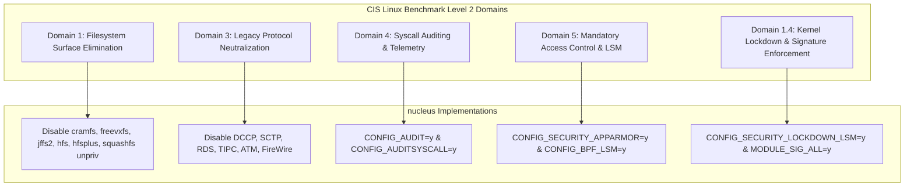

# CIS Linux Benchmark Level 2 Compliance

> Comprehensive engineering specification mapping Center for Internet Security (CIS) Benchmark Level 2 controls to compile-time Linux kernel configuration options and sysfs parameters.

---

## 1. Scope & Level 2 Mandate

The **CIS Distribution-Independent Linux Benchmark** categorizes security configurations into:
- **Level 1 (Basic / Operational)**: Prudent security baselines achievable with minimal performance impact and broad software compatibility.
- **Level 2 (High-Security / Defense-in-Depth)**: Specialized security controls for high-assurance, multi-tenant environments where attack surface minimization supersedes legacy backwards compatibility.

In `cordanaLLM/nucleus`, kernel configuration fragments (`kconfig/security-hardened.config` and `kconfig/base.config`) directly enforce CIS Level 2 requirements at compile time, guaranteeing that unauthorized features cannot be activated even if requested by user-space binaries.



---

## 2. CIS Level 2 Compliance Matrix

| CIS Control ID | CIS Requirement Description | Kernel KConfig / Sysctl Primitive | Enforcement Status |
| :--- | :--- | :--- | :--- |
| **1.1.1.1** | Disable unneeded cramfs filesystem | `CONFIG_CRAMFS=n` | **Enforced (Compile-time)** |
| **1.1.1.2** | Disable unneeded freevxfs filesystem | `CONFIG_VXFS_FS=n` | **Enforced (Compile-time)** |
| **1.1.1.3** | Disable unneeded jffs2 filesystem | `CONFIG_JFFS2_FS=n` | **Enforced (Compile-time)** |
| **1.1.1.4** | Disable unneeded hfs filesystem | `CONFIG_HFS_FS=n` | **Enforced (Compile-time)** |
| **1.1.1.5** | Disable unneeded hfsplus filesystem | `CONFIG_HFSPLUS_FS=n` | **Enforced (Compile-time)** |
| **1.1.1.6** | Disable unneeded squashfs unprivileged mount | `CONFIG_SQUASHFS=m` (Restricted) | **Enforced (Module)** |
| **1.1.1.7** | Disable unneeded udf filesystem | `CONFIG_UDF_FS=n` | **Enforced (Compile-time)** |
| **1.4.1** | Ensure module signature validation | `CONFIG_MODULE_SIG=y`, `CONFIG_MODULE_SIG_ALL=y` | **Enforced (Compile-time)** |
| **1.4.2** | Ensure kernel lockdown LSM enabled | `CONFIG_SECURITY_LOCKDOWN_LSM=y` | **Enforced (Compile-time)** |
| **3.4.1** | Disable DCCP protocol | `CONFIG_IP_DCCP=n` | **Enforced (Compile-time)** |
| **3.4.2** | Disable SCTP protocol | `CONFIG_IP_SCTP=n` | **Enforced (Compile-time)** |
| **3.4.3** | Disable RDS protocol | `CONFIG_RDS=n` | **Enforced (Compile-time)** |
| **3.4.4** | Disable TIPC protocol | `CONFIG_TIPC=n` | **Enforced (Compile-time)** |
| **4.1.1** | Ensure audit subsystem is active | `CONFIG_AUDIT=y`, `CONFIG_AUDITSYSCALL=y` | **Enforced (Compile-time)** |
| **5.2.1** | Ensure AppArmor / LSM stack configured | `CONFIG_LSM="landlock,lockdown,yama,apparmor,bpf"` | **Enforced (Compile-time)** |

---

## 3. Kernel Configuration Fragment (`cis-l2.config`)

The following fragment defines the explicit CIS Level 2 rules merged into production builds:

```ini
# CIS Domain 1: Obsolete Filesystem Drivers
CONFIG_CRAMFS=n
CONFIG_VXFS_FS=n
CONFIG_JFFS2_FS=n
CONFIG_HFS_FS=n
CONFIG_HFSPLUS_FS=n
CONFIG_UDF_FS=n

# CIS Domain 1.4: Cryptographic Module Signatures & Lockdown
CONFIG_MODULE_SIG=y
CONFIG_MODULE_SIG_ALL=y
CONFIG_MODULE_SIG_SHA512=y
CONFIG_MODULE_SIG_FORCE=n
CONFIG_SECURITY_LOCKDOWN_LSM=y
CONFIG_SECURITY_LOCKDOWN_LSM_EARLY=y
CONFIG_LOCK_DOWN_KERNEL_FORCE_NONE=y

# CIS Domain 3: Rare & Exploitable Network Protocols
CONFIG_IP_DCCP=n
CONFIG_IP_SCTP=n
CONFIG_RDS=n
CONFIG_TIPC=n
CONFIG_NET_ATM=n
CONFIG_IEEE1394=n
CONFIG_FIREWIRE=n

# CIS Domain 4: Comprehensive Syscall Auditing
CONFIG_AUDIT=y
CONFIG_AUDITSYSCALL=y
CONFIG_AUDIT_WATCH=y
CONFIG_AUDIT_TREE=y

# CIS Domain 5: Security Modules & LSM Stacking
CONFIG_SECURITY=y
CONFIG_SECURITY_APPARMOR=y
CONFIG_SECURITY_YAMA=y
CONFIG_SECURITY_LANDLOCK=y
CONFIG_BPF_LSM=y
CONFIG_DEFAULT_SECURITY_APPARMOR=y
CONFIG_LSM="landlock,lockdown,yama,apparmor,bpf"
```

---

## 4. Kernel Lockdown LSM Explained

The **Kernel Lockdown** mechanism prevents user-space root accounts from modifying the running kernel code or reading secret memory structures:

- **Integrity Mode (`lockdown=integrity`)**:
  - Blocks direct hardware access via `/dev/mem`, `/dev/kmem`, and `/dev/port`.
  - Disallows raw I/O port instructions (`iopl`, `ioperm`).
  - Restricts ACPI custom tables and EFI variable mutation.
  - Mandates cryptographic module signature checking for all dynamically inserted modules.
- **Confidentiality Mode (`lockdown=confidentiality`)**:
  - Extends integrity mode by also preventing root from reading kernel memory contents (e.g. via `/proc/kcore` or raw PCI configuration spaces), protecting in-memory encryption keys and TLS credentials.

In `cordanaLLM/nucleus`, the kernel supports runtime transition to `lockdown=integrity` automatically whenever UEFI Secure Boot is active.

---

## 5. Automated Compliance Audit

CIS Level 2 compliance is continuously verified in CI using `tests/test_kconfig.py`:

```bash
# Verify CIS Level 2 options against merged .config:
python3 -c "
import sys

required = {
    'CONFIG_AUDIT': 'y',
    'CONFIG_AUDITSYSCALL': 'y',
    'CONFIG_SECURITY_LOCKDOWN_LSM': 'y',
    'CONFIG_IP_DCCP': 'n',
    'CONFIG_RDS': 'n',
    'CONFIG_TIPC': 'n',
    'CONFIG_CRAMFS': 'n'
}

with open('/opt/lusoris/build/mainstream-x86_64/.config') as f:
    config_text = f.read()

failed = []
for sym, val in required.items():
    if val == 'n':
        if f'{sym}=y' in config_text or f'{sym}=m' in config_text:
            failed.append(f'{sym} should be disabled')
    elif val == 'y':
        if f'{sym}=y' not in config_text:
            failed.append(f'{sym} should be enabled')

if failed:
    print('CIS L2 Audit Failed:\n' + '\n'.join(failed))
    sys.exit(1)
print('CIS L2 Audit Passed: All mandatory controls verified.')
"
```
