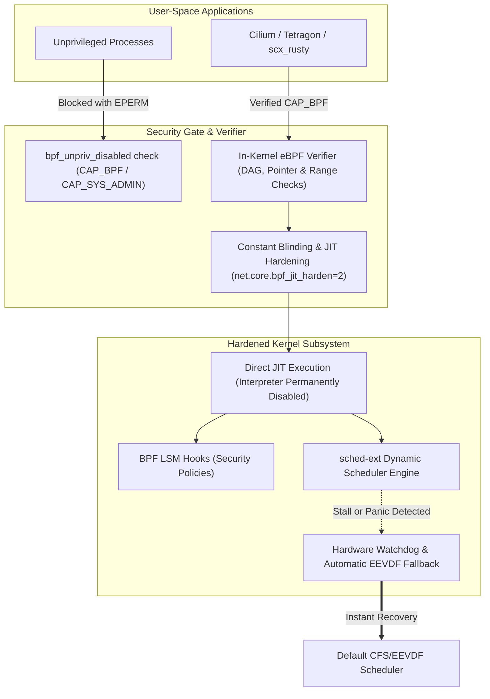
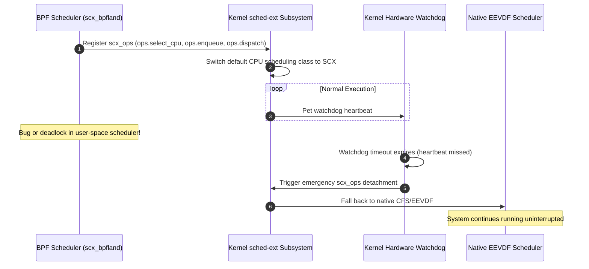

# eBPF Verifier Hardening & sched-ext Containment

> In-depth engineering guide on eBPF verifier security, JIT blinding, BPF LSM access control, and failsafe containment for `sched-ext` dynamic CPU schedulers.

---

## 1. Architectural Role of eBPF in Lusoris

Extended Berkeley Packet Filter (eBPF) provides kernel-level programmability across three foundational pillars in `lusoris-cloud-images`:

1. **High-Performance Networking**: Cilium eBPF datapaths, XDP (eXpress Data Path) DDoS mitigation, and BBRv3 congestion telemetry.
2. **Runtime Security Telemetry**: BPF LSM (Linux Security Module) hooks, system call interception, and container privilege monitoring.
3. **Dynamic CPU Scheduling (`sched-ext`)**: User-space extensible scheduler framework (`CONFIG_SCHED_CLASS_EXT=y`) enabling workload-specific schedulers (e.g., `scx_bpfland`, `scx_rusty`, `scx_lavd`) to optimize cache affinity and gaming/database latencies.

However, loading arbitrary bytecode into the kernel introduces severe risks if not strictly contained. `lusoris-kernel-forge` implements defense-in-depth verifier hardening and hardware watchdog mechanisms.



---

## 2. Kernel Verifier & JIT Hardening Configuration

The following configuration fragment is enforced across all production kernel streams (`kconfig/security-hardened.config`):

```ini
# Core eBPF Subsystem
CONFIG_BPF=y
CONFIG_BPF_SYSCALL=y
CONFIG_BPF_JIT=y
CONFIG_BPF_JIT_ALWAYS_ON=y
CONFIG_BPF_JIT_DEFAULT_ON=y

# Verifier Hardening & Attack Surface Elimination
CONFIG_BPF_UNPRIV_DEFAULT_OFF=y
CONFIG_BPF_PRELOAD=y
CONFIG_BPF_LSM=y

# Extensible Dynamic Scheduler Class (Linux 6.12+ / 7.x)
CONFIG_SCHED_CLASS_EXT=y

# Security Tracing & BTF Metadata
CONFIG_DEBUG_INFO_BTF=y
CONFIG_BPF_EVENTS=y
CONFIG_KPROBES=y
CONFIG_UPROBES=y
```

### Critical Security Rationale:
- **`CONFIG_BPF_JIT_ALWAYS_ON=y`**: Completely compiles out the eBPF bytecode interpreter from the kernel binary. By eliminating the interpreter, an attacker cannot stitch together interpreter opcodes into Return-Oriented Programming (ROP) gadgets.
- **`CONFIG_BPF_UNPRIV_DEFAULT_OFF=y`**: Enforces by default that unprivileged local users cannot invoke `sys_bpf()`. Only processes with `CAP_BPF` or `CAP_SYS_ADMIN` can load programs or inspect maps.
- **`CONFIG_DEBUG_INFO_BTF=y`**: Generates BPF Type Format (BTF) deduplicated debug metadata directly within the kernel image, enabling Compile Once – Run Everywhere (CO-RE) verification without requiring host compiler installations.

---

## 3. Runtime JIT Blinding & Telemetry Controls

At runtime, the following sysctl parameters are applied:

```ini
# /etc/sysctl.d/99-ebpf-hardening.conf
net.core.bpf_jit_harden = 2
net.core.bpf_jit_kallsyms = 1
kernel.unprivileged_bpf_disabled = 1
```

### JIT Constant Blinding (`bpf_jit_harden = 2`):
When user-space programs load BPF instructions containing immediate scalar constants (e.g. `mov r1, 0xdeadbeef`), an attacker might attempt JIT spraying to inject executable shellcode fragments into JIT memory pages. 

Setting `bpf_jit_harden = 2` forces the JIT compiler to blind all user-supplied constants:
1. The kernel generates a cryptographically secure random 32/64-bit mask $M$.
2. The constant $C$ is transformed into $C \oplus M$.
3. The JIT emits instructions that unmask the value at runtime (`val = (C ^ M) ^ M`).
4. As a result, the compiled machine code no longer contains the raw user payload in memory, completely neutralizing JIT-spraying attacks.

---

## 4. `sched-ext` Architecture & Watchdog Containment

`sched-ext` allows developers to replace the default Linux CPU scheduler (`EEVDF`) with dynamic, user-space-directed BPF schedulers:

### 4.1 Failsafe Watchdog & Automatic CFS/EEVDF Fallback
The primary hazard of dynamic scheduling is starvation: an errant BPF scheduler could starve vital system tasks, deadlocking the machine. 

To prevent this, the kernel's `sched-ext` subsystem enforces strict safety invariants:
1. **Heartbeat Timer**: The kernel runs an independent hardware watchdog timer (`scx_watchdog`).
2. **Stall Detection**: If any runnable thread is not scheduled within `scx_watchdog_timeout` (default: 30 seconds), the watchdog triggers.
3. **Graceful Eviction**: The kernel immediately detaches the active `sched-ext` scheduler (`scx_ops`), logs a descriptive trace to `dmesg`, and seamlessly falls back to standard CFS/EEVDF scheduling without dropping active processes or rebooting.



### 4.2 `sched-ext` & Realtime (`PREEMPT_RT`) Coexistence Contract
- In standard kernels (`bleeding`, `mainstream`), `sched-ext` operates freely.
- In the `realtime` (7.2-rt) stream, `CONFIG_PREEMPT_RT=y` requires deterministic microsecond bounded latency. Tasks marked `SCHED_FIFO` or `SCHED_RR` always bypass `sched-ext` and are serviced directly by the real-time scheduling class.

---

## 5. Audit & Diagnostics

To verify eBPF hardening and `sched-ext` status:

```bash
# Check BPF sysctl status
sysctl net.core.bpf_jit_harden kernel.unprivileged_bpf_disabled

# Inspect currently loaded BPF programs and memory consumption
bpftool prog show
bpftool map show

# Check active scheduler class
cat /sys/kernel/sched_ext/state
```
Under operational status, `sysctl` reports `bpf_jit_harden = 2` and `/sys/kernel/sched_ext/state` confirms whether an extensible scheduler is enabled or in fallback state.
